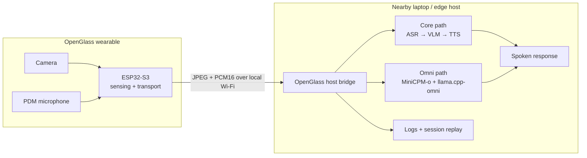

<div align="center">

# OpenGlass

### Local-first visual assistance, from a lightweight pair of glasses

**An open research platform that separates wearable sensing from nearby-device multimodal inference.**

[中文](README_ZN.md) · [Quickstart](docs/quickstart.md) · [Hardware](hardware/README.md) · [Omni Runtime](runtime/openglass_omni/README.md) · [Paper](papers/acl2026.md) · [Safety](docs/safety_privacy.md)

[](https://github.com/OpenSQZ/OpenGlass/stargazers)


<br>


</div>

> [!IMPORTANT]
> **The large multimodal model does not run on the ESP32 glasses.** OpenGlass uses a sensing-computing split: the wearable captures first-person image/audio streams, while a nearby laptop or edge host performs local inference and speech generation.

## Why OpenGlass

First-person visual assistance needs three things at once: a wearable form factor, responsive multimodal reasoning, and careful handling of private camera/audio data. An ESP32-class wearable is excellent at sensing but cannot host a large multimodal model. Cloud-only inference adds another trust and latency boundary.

OpenGlass keeps the glasses lightweight and the compute close:

| Wearable sensing | Nearby-device local inference | Reproducible research |
| --- | --- | --- |
| ESP32-S3 camera, PDM microphone, Wi-Fi transport | Modular ASR/VLM/TTS or experimental MiniCPM-o runtime | Firmware, evaluation tools, latency logs, session replay, and hardware release work |

This makes OpenGlass useful for research on local-first visual assistance without pretending the wearable itself is running the model.

## What You Can Explore

| Find objects | Read visible text | Describe a scene | Study live interaction |
| --- | --- | --- | --- |
| Ask for an item and inspect first-person frames for it | Read signs, labels, and documents when the image is clear | Produce short, evidence-grounded scene descriptions | Measure streaming latency, prompt switching, multiturn behavior, barge-in, and replay |

All outputs are fallible. OpenGlass is not a certified navigation aid, medical device, or safety-critical system.

## How It Works



The tracked firmware currently exposes:

| Interface | Endpoint | Purpose |
| --- | --- | --- |
| HTTP | `http://<ESP32_IP>/capture` | Single JPEG capture |
| HTTP | `http://<ESP32_IP>:81/stream` | MJPEG preview stream |
| WebSocket | `ws://<ESP32_IP>/ws_audio` | PCM16 microphone stream |

The experimental bridge also supports `/ws_audio_v2`; select the endpoint that matches the firmware you actually flashed.

## Three Tracks, One Project

| Track | What lives here | Status |
| --- | --- | --- |
| **OpenGlass-Core** | ESP32-S3 sensing firmware, nearby-host ASR/VLM/TTS experiments, evaluation and latency tooling | Available |
| **OpenGlass-Hardware** | [AI Smart Glasses Open-Source Report](hardware/AI_GLASSES_OPEN_SOURCE_REPORT_EN.md), 3D-printable frame, CAD/STL/3MF, BOM, wiring, assembly, printing and validation docs | Release package under verification |
| **OpenGlass-OmniRuntime** | Standalone panel around external MiniCPM-o-Demo and llama.cpp-omni checkouts, ESP32 bridge, prompt switching, recording and replay | Experimental; local smoke test passed |

## Quick Start

Clone OpenGlass first:

```bash
git clone https://github.com/OpenSQZ/OpenGlass.git
cd OpenGlass
```

Choose the path that matches what you want to test.

### 1. Smoke-test the evaluation pipeline

This path needs no glasses and makes no cloud request. The current `cloud_api.yaml` uses the repository's stub adapter to exercise manifests, metrics, and run output.

```bash
python -m venv .venv
# Windows: .venv\Scripts\activate
# Linux/macOS: source .venv/bin/activate
python -m pip install -r eval_benchmark/requirements.txt
python -m eval_benchmark.src.run_eval --config eval_benchmark/configs/cloud_api.yaml
```

For real local inference, start an OpenAI-compatible VLM server separately and review [`eval_benchmark/README.md`](eval_benchmark/README.md) before selecting a non-stub config.

### 2. Flash and test the ESP32 sensing firmware

1. Open [`CameraWebServer_PDM_Audio.ino`](CameraWebServer_PDM_Audio/CameraWebServer_PDM_Audio.ino) in Arduino IDE and follow the [firmware setup guide](CameraWebServer_PDM_Audio/README.md).
2. Select the XIAO ESP32-S3 board profile and the matching camera configuration.
3. Replace `YOUR_WIFI_NAME` and `YOUR_WIFI_PASSWORD` locally. Never commit real credentials.
4. Compile, flash, and open Serial Monitor.
5. Read the DHCP address as `<ESP32_IP>` and test `/capture`, `:81/stream`, and `/ws_audio` on your local network. This address may change after a restart.

The tracked PDM mapping is `IO42 = CLK` and `IO41 = DATA`. Confirm it against your physical revision before powering the wearable.

### 3. Launch the experimental Omni control panel

OpenGlass keeps upstream projects external. Clone them next to, not inside, this repository:

```bash
git clone --branch feat/web-demo https://github.com/tc-mb/llama.cpp-omni.git
git clone --branch Comni https://github.com/OpenBMB/MiniCPM-o-Demo.git
```

Build llama.cpp-omni once using its upstream instructions, configure MiniCPM-o-Demo's ignored `config.json`, then create the OpenGlass local adapter config:

```bash
python -m pip install -r <MINICPM_O_DEMO_ROOT>/requirements.txt
python -m pip install -r runtime/openglass_omni/requirements.txt
cp runtime/openglass_omni/runtime.example.json runtime/openglass_omni/runtime.local.json
cp examples/configs/devices.example.json runtime/openglass_omni/devices.local.json

python glasses_panel.py --check
python glasses_panel.py
```

Edit `devices.local.json` and replace the example `esp32_host` with the `<ESP32_IP>` printed by Serial Monitor. Keep `devices_file` set to `devices.local.json` in `runtime.local.json`. On Windows PowerShell, replace `cp` with `Copy-Item`. The launcher reuses an existing llama.cpp-omni build; it does not clone, update, or compile upstream repositories for you. See the [full Omni setup](runtime/openglass_omni/README.md).

### Panel lifecycle

| Control | Behavior |
| --- | --- |
| **Start** | Starts upstream worker, upstream gateway, then the OpenGlass ESP32 bridge |
| **Restart / Stop** | Restarts or stops only the OpenGlass bridge; the model stays warm |
| **Restart All / Stop All** | Operates on all three managed processes; stopping the worker also stops its llama-server child process |
| **Apply Prompt** | Restarts only the OpenGlass bridge with the selected prompt |

## Hardware Build Path

The hardware track is being prepared as a versioned, reproducible release rather than a folder of unexplained print files.

```text
CAD source → reviewed STL exports → 3MF plate → sanitized BOM
          → wiring + pin map → assembly → firmware test → end-to-end validation
```

| Artifact | Public status |
| --- | --- |
| Editable STEP / 3MF source | Available in internal source materials; publication review pending |
| STL exports | Not yet published |
| BOM spreadsheet | Exists in source materials; component and link sanitization pending |
| Wiring / assembly guide | In preparation |
| Photos and videos | Candidate materials exist; privacy and rights review pending |
| Battery, charging, thermal and comfort results | Require human verification |

Start with the [hardware overview](hardware/README.md), then follow the evolving [CAD and 3D-printing guide](hardware/cad_3d_print/README.md), [BOM guide](hardware/bom/README.md), and [safety boundary](docs/safety_privacy.md). Do not build or wear an unverified battery-powered prototype solely from draft notes.

## Repository Map

```text
OpenGlass/
├── CameraWebServer_PDM_Audio/   # ESP32-S3 camera + PDM microphone firmware
├── eval_benchmark/              # Evaluation, latency, baselines, Omni harnesses
├── runtime/openglass_omni/      # Standalone experimental Omni adapter and UI
├── hardware/                    # CAD/BOM/assembly release documentation
├── docs/                        # Architecture, quickstart, safety, roadmap
├── papers/                      # Publication pages and citation status
├── examples/configs/            # Sanitized local configuration examples
└── assets/                      # Candidate public figures and prototype media
```

## Documentation

| I want to... | Start here |
| --- | --- |
| Understand the design | [Project overview](docs/overview.md) · [Architecture](docs/architecture.md) |
| Run the software | [Quickstart](docs/quickstart.md) · [Omni Runtime](runtime/openglass_omni/README.md) |
| Build the wearable | [AI Smart Glasses Open-Source Report](hardware/AI_GLASSES_OPEN_SOURCE_REPORT_EN.md) · [CAD/printing](hardware/cad_3d_print/README.md) · [BOM](hardware/bom/README.md) |
| Run evaluations | [Evaluation README](eval_benchmark/README.md) · [Rubric](eval_benchmark/rubric_nlp_v3.md) |
| Prepare a release | [Roadmap](docs/roadmap.md) · [Release checklist](docs/release_checklist.md) |
| Plan a user study | [Safety and privacy](docs/safety_privacy.md) |

## Current Boundaries

- Model inference runs on a nearby host, never on the ESP32 glasses.
- The Omni runtime is experimental and is not a production-ready skill platform.
- One-click session rerun UI, skill import/restart, and long-session reliability remain open work.
- Rokid source/APK is not included in the current public package.
- Hardware naming, BOM, battery, charging, autofocus, comfort, and print settings still require verification.
- Model weights, private recordings, credentials, real device addresses, and upstream repositories are not vendored here.

## Safety and Privacy

OpenGlass is a research prototype. It can be wrong, late, incomplete, or unavailable. Do not rely on it for street crossing, vehicle avoidance, medical decisions, hazardous environments, or other safety-critical tasks.

First-person cameras and microphones can capture bystanders, screens, documents, homes, workplaces, and location clues. Local inference reduces default exposure but is not a privacy guarantee. Review and minimize saved frames, audio, transcripts, and logs. Read the full [safety and privacy guide](docs/safety_privacy.md) before user-facing tests.

## Contributing

Contributions are especially useful in these areas:

- Clean-machine setup validation on Windows, Linux, and different GPUs.
- ESP32 `/ws_audio` and runtime `/ws_audio_v2` protocol reconciliation.
- Session rerun UI and privacy-preserving replay tools.
- Skill restart/import interfaces with honest experimental labeling.
- Sanitized CAD, STL, 3MF, BOM, wiring, assembly, and validation artifacts.
- Accessibility feedback and controlled studies with blind and low-vision users.

Please do not submit model weights, private recordings, credentials, personal data, raw private logs, or unpublished submission materials.

## Publication

**OpenGlass: A Sensing-Computing Split Architecture for Local MLLM-Driven Real-Time Visual Assistance**<br>
Mengzhang Li and Yuan Yao · ACL 2026 System Demonstrations

Official paper metadata and final BibTeX are still awaiting public verification. See [`papers/acl2026.md`](papers/acl2026.md); do not invent an Anthology URL, DOI, pages, or numerical results.

## Upstream Projects

OpenGlass integrates with, rather than vendors, upstream projects including [MiniCPM-o](https://github.com/OpenBMB/MiniCPM-o), [MiniCPM-o-Demo](https://github.com/OpenBMB/MiniCPM-o-Demo), [llama.cpp-omni](https://github.com/tc-mb/llama.cpp-omni), and the broader [llama.cpp](https://github.com/ggml-org/llama.cpp) ecosystem.

## License

This branch does not yet contain a repository license. Until the project owner publishes one, do not assume permission to redistribute or reuse the code or assets.

<div align="center">

**Wearable sensing. Nearby-device local inference. Open research.**

</div>
