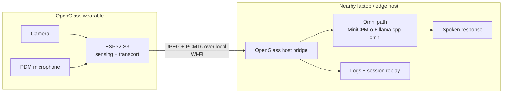

<div align="center">

# OpenGlass

### Local-first visual assistance, from a lightweight pair of glasses

**An open research platform that separates wearable sensing from nearby-device multimodal inference.**

[中文](README_zh.md) · [Quickstart](docs/quickstart.md) · [Hardware](hardware/README.md) · [Omni Runtime](runtime/openglass_omni/README.md) · [Paper](papers/acl2026.md) · [Safety](docs/safety_privacy.md)


<br>


</div>

> [!IMPORTANT]
> **The large multimodal model does not run on the ESP32 glasses.** OpenGlass uses a sensing-computing split: the wearable captures first-person image/audio streams, while a nearby laptop or edge host performs local inference and speech generation.

## Why OpenGlass

First-person visual assistance needs three things at once: a wearable form factor, responsive multimodal reasoning, and careful handling of private camera/audio data. An ESP32-class wearable is excellent at sensing but cannot host a large multimodal model. Cloud-only inference adds another trust and latency boundary.

OpenGlass keeps the glasses lightweight and the compute close:

| Wearable sensing | Nearby-device local inference | Reproducible research |
| --- | --- | --- |
| ESP32-S3 camera, PDM microphone, Wi-Fi transport | Modular ASR/VLM/TTS or experimental MiniCPM-o runtime | Firmware, evaluation tools, latency logs, session replay, and hardware release work |

This makes OpenGlass useful for research on local-first visual assistance without pretending the wearable itself is running the model.

## What You Can Explore

| Find objects | Read visible text | Describe a scene | Study live interaction |
| --- | --- | --- | --- |
| Ask for an item and inspect first-person frames for it | Read signs, labels, and documents when the image is clear | Produce short, evidence-grounded scene descriptions | Measure streaming latency, prompt switching, multiturn behavior, barge-in, and replay |

All outputs are fallible. OpenGlass is not a certified navigation aid, medical device, or safety-critical system.

## How It Works



The wearable only senses and streams; the panel on the nearby host starts the model backend and bridges the glasses to it.

## Three Tracks, One Project

| Track | What lives here | Status |
| --- | --- | --- |
| **OpenGlass-Core** | ESP32-S3 sensing firmware, nearby-host experiments, evaluation and latency tooling | Available |
| **OpenGlass-Hardware** | 3D-printable frame, CAD/STL/3MF, BOM, wiring, assembly and validation docs | Release package under verification |
| **OpenGlass-OmniRuntime** | Standalone panel around external MiniCPM-o-Demo and llama.cpp-omni checkouts, ESP32 + Rokid bridges, prompt switching, recording and replay | Experimental; verified working on the maintainer's setup |

---

## Quick Start — Omni Control Panel

This is the end-to-end path: build the model backend, bring up the upstream services, flash the glasses, then drive everything from the panel.

> The panel is a thin launcher. It starts and supervises three processes (`worker` → `gateway` → `esp32_bridge`) and shows the glasses' first-person view. **It does not clone, build, or configure the upstream model projects for you** — you set those up once, following the steps below.

### Step 1 — Build llama.cpp-omni (the model backend)

Clone and build [llama.cpp-omni](https://github.com/tc-mb/llama.cpp-omni) (`master` branch). On Windows, the *x64 Native Tools Command Prompt for VS 2022* is recommended; CURL is not required.

```bash
git clone https://github.com/tc-mb/llama.cpp-omni
cmake -B build -DCMAKE_BUILD_TYPE=Release -DGGML_CUDA=ON -DLLAMA_CURL=OFF
cmake --build build --config Release --target llama-omni-server -j
```

A successful build produces `build/bin/Release/llama-omni-server.exe`.

Prepare the MiniCPM-o model weights (download from Hugging Face) in this directory layout:

```text
<model_root>/
├── MiniCPM-o-4_5-Q4_K_M.gguf
├── vision/MiniCPM-o-4_5-vision-F16.gguf
├── audio/MiniCPM-o-4_5-audio-F16.gguf
├── tts/MiniCPM-o-4_5-tts-F16.gguf
├── tts/MiniCPM-o-4_5-projector-F16.gguf
└── token2wav-gguf/
```

You can sanity-check the backend by launching it directly (the panel will do this for you later, indirectly, via the worker):

```bash
llama-omni-server.exe -m <path-to-gguf> -ngl 99 --host 127.0.0.1 --port 22500 --ctx-size 8192
```

### Step 2 — Set up MiniCPM-o-Demo (worker + gateway)

Clone [MiniCPM-o-Demo](https://github.com/OpenBMB/MiniCPM-o-Demo) (`master` branch) and install its dependencies:

```bash
git clone https://github.com/OpenBMB/MiniCPM-o-Demo
cd MiniCPM-o-Demo
pip install -r requirements.txt
```

Verify the upstream services work on their own before involving the panel:

```bash
# 1) backend (from the llama.cpp-omni build)
llama-omni-server.exe -m <path-to-gguf> -ngl 99 --host 127.0.0.1 --port 22500 --ctx-size 8192
# 2) worker (waits until the backend /health is ready)
python worker.py --host 0.0.0.0 --port 22400 --gpu-id 0 --backend-server-url http://127.0.0.1:22500
# 3) gateway
python gateway.py
```

> [!WARNING]
> **Fix the 300 s auto-disconnect.** In the gateway code, video duplex mode ends after 300 s and drops the connection. Change:
> ```python
> max_duration_s = 300 if mode == "video" else 600
> ```
> to:
> ```python
> max_duration_s = None if mode == "video" else 600
> ```

Open `http://localhost:8006` and confirm you can talk to the model using the PC's own webcam and microphone. Once that works, the upstream `worker.py` + `gateway.py` path is confirmed — the panel relies on exactly this path.

### Step 3 — Install OpenGlass (as its own directory)

Clone this repository to its own location (it does **not** need to live inside MiniCPM-o-Demo), and install its dependencies into the **same** environment you will run the panel from:

```bash
git clone <this-repo> OpenGlass
cd OpenGlass
pip install -r requirements.txt
```

Then open `runtime/openglass_omni/panel.py` and set the paths in `CONFIG` (all marked with `<PATH_TO>`):

- **`procs["llama"]`** — the `llama-omni-server.exe` path and the `-m` GGUF path (from Steps 1–2).
- **`minicpm_demo_dir`** — the MiniCPM-o-Demo directory (where `worker.py` / `gateway.py` live). The panel starts worker and gateway *in that directory*, so it must point at your MiniCPM-o-Demo clone, e.g. `r"D:\MiniCPM-o-Demo"`.

Confirm the ESP32 glasses and the PC are on the **same Wi-Fi**, find the glasses' IP in the Arduino IDE Serial Monitor (e.g. `192.168.10.174`), and confirm you can view its stream in a browser.

Edit `runtime/openglass_omni/devices.json` — name each pair of glasses and give its IP and default rotation. Names are arbitrary; you pick from them in the panel after launch:

```json
{
  "_comment": "One entry per pair of glasses. After flashing, read the IP from Serial Monitor and set esp32_host. 'rotate' is the clockwise camera rotation (0/90/180/270) for how that unit is physically mounted. Each laptop keeps its own copy. The gateway port is not configured here.",
  "devices": [
    { "name": "left",  "esp32_host": "192.168.10.174", "esp32_port": 80, "rotate": 270 },
    { "name": "right", "esp32_host": "192.168.43.148", "esp32_port": 80, "rotate": 180 },
    { "name": "spare", "esp32_host": "192.168.43.149", "esp32_port": 80, "rotate": 180 }
  ]
}
```

### Step 4 — Launch the panel

From the OpenGlass directory:

```bash
python glasses_panel.py
```

The panel opens a control window. It defaults to the first device in `devices.json`; switch with the dropdown. Click **Start (一键启动)** to bring up `llama-omni-server → worker → gateway → demo` in order — the panel launches the backend, waits for its `/health` to return 200, then starts the worker and gateway (in `minicpm_demo_dir`) and the ESP32 bridge. When all indicators are green, the right side shows the glasses' first-person view and you can talk to the model through the glasses.

If the view stays blank, check the network — the PC and the ESP32 must be on the same Wi-Fi.

## Panel Lifecycle

| Control | Behavior |
| --- | --- |
| **Start (一键启动)** | Starts `llama-omni-server` → `worker` → `gateway` → `demo` in order, waiting for each to be ready (backend `/health`, then worker/gateway ports) |
| **Stop (停止)** | Stops only the demo (the current session); the backend, worker, and gateway stay warm |
| **Start again** | After **Stop**, brings the demo back up (fast — backend/worker/gateway still running) |
| **Stop All (全部停止)** | Stops demo, then gateway, then worker, then the llama-omni-server backend |
| **Chain dropdown** | Switches between the **ESP32** and **Rokid** links (front three stages shared; only the fourth process differs) |
| **Prompt** | Pick a preset or edit the prompt, then Start; the selected prompt is passed to the demo |

## Configuration

Everything you need to configure lives in a few places. Model paths and backend settings belong to the **upstream** projects, not here.

| What | Where | Notes |
| --- | --- | --- |
| **Backend & model paths** | `procs["llama"]` in `runtime/openglass_omni/panel.py` `CONFIG` | **Must edit.** Set the `llama-omni-server.exe` path (llama.cpp-omni build output) and the `-m` GGUF path (MiniCPM-o main weights; vision/audio/tts submodels go in sibling dirs — see the model layout above). |
| **Glasses IP / rotation** | `runtime/openglass_omni/devices.json` | One entry per pair; the panel dropdown follows this file. Add a device by editing the JSON — no code change. |
| **Conda environment** | `conda_env` in `panel.py` `CONFIG` | Set to your **named** virtual environment. **Do not use `base`** (see warning below). Leave `None` only if you run the panel from an already-activated environment. |
| **MiniCPM-o-Demo directory** | `minicpm_demo_dir` in `panel.py` `CONFIG` | **Must edit.** Absolute path to your MiniCPM-o-Demo clone (where `worker.py`/`gateway.py` live). The panel starts worker and gateway in this directory. |
| **Worker ready port** | `worker_ready_port` in `panel.py` `CONFIG` | Must equal the port your `worker.py` listens on (default `22400`). If it mismatches, the panel still starts via a stable-alive fallback, but matching it is faster and cleaner. |
| **Working directory** | `cwd` in `panel.py` `CONFIG` | Optional. Only affects llama/demo/rokid, which already use absolute paths — normally leave empty. |

> [!WARNING]
> **Use a named conda environment, not `base`.** The panel starts the demo with `conda run -n <env> python esp32_bridge.py --prompt "..."`. When `<env>` is `base`, `conda run` can truncate multi-line arguments, so a multi-line system prompt is silently dropped and the model falls back to a generic default ("a friendly assistant"). A named environment (`conda create -n openglass ...`) avoids this. If `conda_env` is `None`, the panel uses the current interpreter directly and is unaffected.

## Session Recording and Replay

Every session is recorded locally by `recorder_live.py` (video, audio tracks, subtitles, and metadata under `sessions/`). The bridge's web UI (`bridge_ui.py`, default `http://localhost:8080`) serves both the live first-person view shown inside the panel and a replay browser at `/replay`.

`rerun_source.py` is a separate command-line tool that replays a recorded session back through the model — useful for repeatable testing without the glasses. It is not wired into the panel:

```bash
python runtime/openglass_omni/esp32_bridge.py \
  --rerun-from sessions/<session-id> \
  --gateway localhost:8040 \
  --prompt "your prompt"
```

## Hardware Build Path

The hardware track is being prepared as a versioned, reproducible release. Start with the [hardware overview](hardware/README.md), then follow the [CAD and 3D-printing guide](hardware/cad_3d_print/README.md), [BOM guide](hardware/bom/README.md), and [safety boundary](docs/safety_privacy.md). Do not build or wear an unverified battery-powered prototype solely from draft notes.

### Flashing the ESP32 firmware

1. Install [Arduino IDE 2.x](https://www.arduino.cc/en/software).
2. In *File → Preferences → Additional boards manager URLs*, add:
   `https://espressif.github.io/arduino-esp32/package_esp32_index.json`
3. In *Tools → Board → Boards Manager*, search `esp32` and install *esp32 by Espressif Systems* (this takes a while).
4. Open `CameraWebServer_PDM_Audio.ino`, connect the glasses over USB, and select the new serial port (e.g. `COM3`). Under *Tools → PSRAM*, choose **OPI PSRAM**.
5. Set `ssid` and `password` to the same Wi-Fi the PC uses:
   ```cpp
   const char *ssid = "YOUR_WIFI_NAME";
   const char *password = "YOUR_WIFI_PASSWORD";
   ```
   Never commit real credentials.
6. Click **Upload**. After flashing, open Serial Monitor at baud `115200` to see the network status and the glasses' IP.

## Repository Map

```text
OpenGlass/
├── glasses_panel.py             # Entry shim → runtime.openglass_omni.panel:main
├── runtime/openglass_omni/      # Standalone Omni control panel + ESP32/Rokid bridges
│   ├── panel.py / panel.html    # Control panel logic and its UI
│   ├── esp32_bridge.py          # ESP32 duplex bridge (host-side demo)
│   ├── rokid_minicpm_v8.py      # Rokid link
│   ├── bridge_ui.py             # Live view + replay web server
│   ├── recorder_live.py         # Local session recording
│   ├── rerun_source.py          # Replay a recorded session through the model
│   ├── devices.json             # Glasses IP / rotation
│   └── templates/               # live.html, replay.html, replay_index.html
├── CameraWebServer_PDM_Audio/   # ESP32-S3 camera + PDM microphone firmware
├── eval_benchmark/              # Evaluation, latency, baselines
├── hardware/                    # CAD/BOM/assembly release documentation
├── docs/                        # Architecture, quickstart, safety, roadmap
├── papers/                      # Publication pages and citation status
└── assets/                      # Prototype photos and figures used in the docs
```

## Current Boundaries

- Model inference runs on a nearby host, never on the ESP32 glasses.
- The Omni runtime is experimental and is not a production-ready skill platform.
- The panel starts and supervises processes and shows the first-person view; it does **not** own model weights, backend paths, or upstream configuration.
- `worker.py` / `gateway.py` and the model weights come from external upstream projects and are not vendored here.
- The Rokid link is included, but its gateway protocol may differ from the ESP32 link depending on your build; treat the ESP32 link as the primary supported path.
- Hardware naming, BOM, battery, charging, autofocus, comfort, and print settings still require verification.

## Upstream Projects

- [llama.cpp-omni](https://github.com/tc-mb/llama.cpp-omni) — the C++ model backend (`llama-omni-server`).
- [MiniCPM-o-Demo](https://github.com/OpenBMB/MiniCPM-o-Demo) — provides `worker.py` and `gateway.py`, plus the model/backend configuration.

Clone these as their **own independent directories** — OpenGlass does not need to live inside MiniCPM-o-Demo, and nothing is copied between them. Build llama.cpp-omni once, configure MiniCPM-o-Demo per its own documentation, then point OpenGlass at both via `procs["llama"]` and `minicpm_demo_dir` in `panel.py`. OpenGlass reuses an existing setup and does not compile or configure upstream for you.

## License

See [LICENSE](LICENSE).
