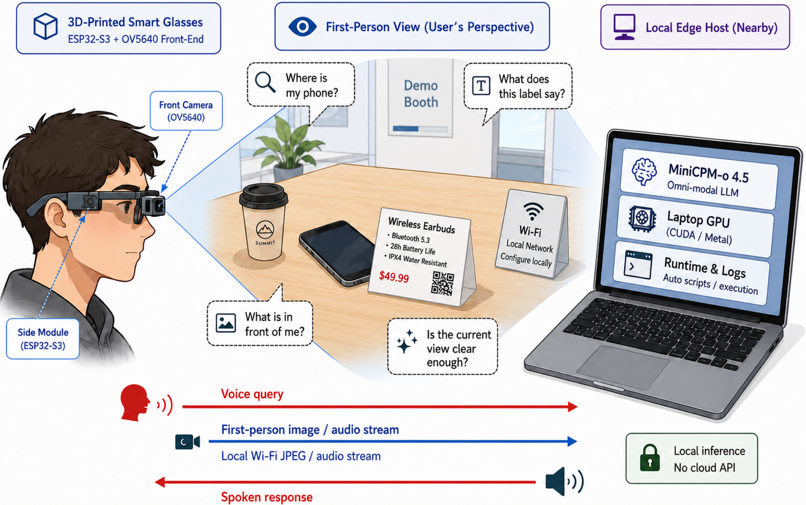
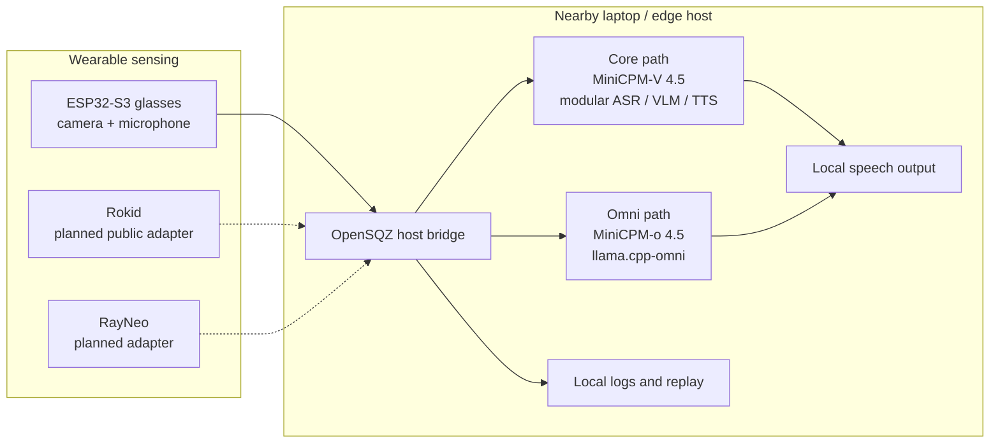

# OpenSQZ Glass

### Wearable sensing. Nearby local intelligence.

**An open-source research platform for local-first visual assistance, connecting lightweight first-person sensing with multimodal inference on a nearby laptop or edge host.**

[中文](README_zh.md) · [Quick Start](#quick-start) · [Hardware Guide](hardware/AI_GLASSES_OPEN_SOURCE_REPORT_EN.md) · [ACL 2026 Paper](https://aclanthology.org/2026.acl-demo.82/) · [Safety & Privacy](docs/safety_privacy.md) · [Roadmap](docs/roadmap.md)


*OpenSQZ Glass 3D-printed frame and sensing hardware.*

> **Important:** The large model does not run on the ESP32 glasses. OpenSQZ Glass uses a sensing-computing split: the wearable captures first-person image and audio streams, while a nearby user-controlled computer performs local inference and speech generation.

> **Research boundary:** OpenSQZ Glass is a research prototype. It is not a certified navigation aid, medical device, safety-critical system, or production-ready skill platform.

## News

- **[2026.08.04]** 📢📢📢 We introduce **OpenSQZ Glass** as the umbrella project for our sensing hardware, local multimodal runtimes, and related research tracks. [Explore the project map](#tracks-and-maturity).
- **[2026.08.03]** 🥳🥳🥳 We integrated the experimental [OmniRuntime](runtime/openglass_omni/README.md), including the control panel, ESP32 bridge, prompt switching, and local session recording/replay tools. [Try it now!](#quick-start)
- **[2026.07.22]** 🔥🔥🔥 We open-source the complete first hardware release: an [editable STEP frame](hardware/cad_3d_print/A02_frame_source.step), [3MF print plate](hardware/cad_3d_print/A03_print_plate.3mf), [sanitized BOM](hardware/bom/A01_bom_public.xlsx), project images, and a [bilingual build guide](hardware/AI_GLASSES_OPEN_SOURCE_REPORT_EN.md). Try it out!
- **[2026.07.21]** ⭐️⭐️⭐️ OpenSQZ Glass was demonstrated at **WAIC 2026** and featured by InfoQ in [*OpenSQZ Glass: Bringing End-Side Full-Duplex Omnimodal Models into the First-Person Wearable World*](https://www.infoq.cn/article/UZ1j5LXmjNgiCfu5QL0s).
- **[2026.07.20]** 🚀🚀🚀 Our 3D-printed wearable hardware demo, **OmniGlass-Edge**, was accepted to [UbiComp/ISWC 2026](https://www.ubicomp.org/ubicomp-iswc-2026/) Posters & Demos! See the [open hardware guide](hardware/AI_GLASSES_OPEN_SOURCE_REPORT_EN.md).
- **[2026.07]** 📄📄📄 Our ACL 2026 System Demonstration paper, [*OpenGlass: A Sensing-Computing Split Architecture for Local MLLM-Driven Real-Time Visual Assistance*](https://aclanthology.org/2026.acl-demo.82/), is now available in the ACL Anthology. [Read the paper](papers/acl2026.md).
- **[2026.04.26]** 🎉🎉🎉 Our **OpenGlass sensing-computing split system**, one research track within the broader OpenSQZ Glass project, was accepted to the [ACL 2026 System Demonstrations](https://aclanthology.org/2026.acl-demo.82/) track!
- **[2026.03.03]** 🔥🔥🔥 The OpenGlass repository is officially released with ESP32 sensing firmware and evaluation scripts. [Try it out!](#quick-start)

## Overview

OpenSQZ Glass brings several related research directions into one repository without treating them as one finished product. The common idea is simple:



*System overview for the UbiComp/ISWC hardware direction, adapted from Figure 1. Network credentials are replaced with a public-safe local-configuration prompt.*

| On the glasses | On the nearby host | In this repository |
| --- | --- | --- |
| ESP32-S3 camera and PDM microphone capture first-person context | A laptop or edge host runs ASR/VLM/TTS or MiniCPM-o locally | Firmware, host bridges, evaluation tools, experimental runtime, session replay, and hardware documentation |

The sensing device, model backend, and publication track are independent axes. An ESP32 is a device, MiniCPM-V and MiniCPM-o are model paths, and ACL or UbiComp/ISWC identifies a research snapshot rather than a separate product fork.



Solid arrows represent code or artifacts present in the public repository. Dashed device links are planned and must not be interpreted as released support.

## Tracks and Maturity

| Research direction | Device | Model/backend | Scope | Maturity |
| --- | --- | --- | --- | --- |
| **ACL 2026 / OpenGlass-Core** | ESP32-S3 glasses | **MiniCPM-V 4.5**, modular ASR/VLM/TTS | Sensing-computing split, local visual assistance, evaluation and latency artifacts | Published research baseline; reproduction artifacts available |
| **UbiComp/ISWC Hardware** | OpenSQZ 3D-printed ESP32 frame | Backend-independent | CAD, print plate, BOM, module placement, assembly and validation documentation | Public draft; several hardware facts still require verification |
| **OmniRuntime / ESP32** | ESP32-S3 glasses | **MiniCPM-o 4.5** + `llama.cpp-omni` | Control panel, live multimodal bridge, prompt switching, recording and replay | Experimental; observed on the maintainer setup, clean-machine validation pending |
| **OmniRuntime / Rokid** | Rokid glasses | MiniCPM-o 4.5 | APK-to-host bridge and shared runtime | Planned public integration; required bridge/APK source is not in the current public tree |
| **Future device adapters** | RayNeo and other glasses | To be selected | Additional device-specific transport adapters | Planned; no public implementation yet |

**Current development default:** MiniCPM-o 4.5 is the default experimental runtime path. The ACL 2026 system is a distinct, reproducible research snapshot built around MiniCPM-V 4.5; it is one part of OpenSQZ Glass, not the identity of the whole project.

## Device Status

| Device family | Public artifacts | Current status |
| --- | --- | --- |
| **ESP32-S3 prototype** | Camera/PDM firmware, device registry format, host bridge, evaluation scripts, CAD/BOM/docs | Primary public sensing path; local Wi-Fi and DHCP configuration required |
| **Rokid** | Launcher profile and documentation references | Not runnable from a clean public clone because the required bridge source and APK are not currently published |
| **RayNeo** | No adapter source yet | Reserved as a future device boundary; not currently supported |

## Quick Start

The control panel is intended to make **repeated runs** one-click after a one-time setup. It does not download model weights, clone upstream repositories, compile `llama.cpp-omni`, or flash the ESP32 for you.

> **Current clean-clone status:** The panel UI starts from the repository root, but the current launcher still reads machine-specific paths from `runtime/openglass_omni/panel.py`. The included `runtime.local.json` loader is not yet connected to that panel. Follow the effective configuration locations below; a code update is still required before this can be called a portable one-click installation.

### 1. Prerequisites

The currently exercised maintainer path uses:

- Windows 11, Python 3.10, and an activated Conda environment.
- An NVIDIA GPU and CUDA-capable `llama.cpp-omni` build.
- Visual Studio 2022 C++ Build Tools and CMake.
- Arduino IDE with ESP32 board support for firmware flashing.
- MiniCPM-o 4.5 GGUF weights stored outside this repository.
- A local Wi-Fi network shared by the host and ESP32 glasses.

Model weights are not distributed by this repository.

### 2. Clone the pinned upstream revisions

Keep all three repositories independent. Do not copy OpenSQZ Glass files into MiniCPM-o-Demo.

```powershell
git clone https://github.com/tc-mb/llama.cpp-omni.git
cd llama.cpp-omni
git checkout feat/web-demo
git checkout 5202b7b
cmake -B build -DCMAKE_BUILD_TYPE=Release -DGGML_CUDA=ON -DLLAMA_CURL=OFF
cmake --build build --config Release --target llama-omni-server -j
cd ..

git clone https://github.com/OpenBMB/MiniCPM-o-Demo.git
cd MiniCPM-o-Demo
git checkout Comni
git checkout 9af4308
python -m pip install -r requirements.txt
cd ..

git clone https://github.com/OpenSQZ/OpenGlass.git
cd OpenGlass
python -m pip install -r runtime/openglass_omni/requirements.txt
```

These revisions match [`runtime/openglass_omni/upstream-lock.json`](runtime/openglass_omni/upstream-lock.json). Newer upstream revisions may change ports, arguments, process ownership, or whether `worker.py` launches `llama-omni-server` itself.

### 3. Prepare the model files

Place the MiniCPM-o 4.5 GGUF modules in one external directory. The current launcher expects the main model path passed with `-m`; the vision, audio, TTS, and Token2Wav files must follow the layout required by your pinned `llama.cpp-omni` revision.

```text
MiniCPM-o-4_5-gguf/
├── MiniCPM-o-4_5-Q4_K_M.gguf
├── vision/
├── audio/
├── tts/
└── token2wav-gguf/
```

Follow the upstream [`llama.cpp-omni` prerequisites](https://github.com/tc-mb/llama.cpp-omni#prerequisites) for exact filenames and downloads.

### 4. Register your ESP32 glasses

Create the ignored local device registry:

```powershell
Copy-Item examples/configs/devices.example.json runtime/openglass_omni/devices.json
```

Edit `runtime/openglass_omni/devices.json`:

```json
{
  "devices": [
    {
      "name": "My-Glasses",
      "esp32_host": "YOUR_ESP32_IP",
      "esp32_port": 80,
      "rotate": 0
    }
  ]
}
```

- `name` is the ID shown in the panel dropdown.
- `esp32_host` is the DHCP address printed by the ESP32 serial monitor after boot.
- `rotate` is clockwise camera rotation: `0`, `90`, `180`, or `270`.
- The local registry is ignored by Git. Never commit private device addresses.

### 5. Configure the current launcher

At present, these are the **effective** settings:

| What to configure | Effective location now | Value |
| --- | --- | --- |
| MiniCPM-o-Demo checkout | [`panel.py` `CONFIG["minicpm_demo_dir"]`](runtime/openglass_omni/panel.py) | Absolute path containing upstream `worker.py` and `gateway.py` |
| `llama-omni-server` binary | [`panel.py` `CONFIG["procs"]["llama"]`](runtime/openglass_omni/panel.py) | Compiled executable under `llama.cpp-omni/build` |
| Main GGUF model | Same `llama` command after `-m` | Absolute path to the main MiniCPM-o 4.5 GGUF |
| Glasses name/IP/rotation | `runtime/openglass_omni/devices.json` | One entry per ESP32 glasses prototype |
| Prompt presets | [`panel.py` `CONFIG["presets"]`](runtime/openglass_omni/panel.py) | Interaction prompts shown by the current panel |

[`runtime.example.json`](runtime/openglass_omni/runtime.example.json) and [`prompts.json`](runtime/openglass_omni/prompts.json) document the intended local configuration boundary, but the current panel does not consume either file. Copying the runtime example to `runtime.local.json` does **not yet replace** the hardcoded panel paths or prompt presets. This is a known integration issue, not a user configuration mistake.

### 6. Configure and flash Wi-Fi firmware

Open [`CameraWebServer_PDM_Audio/CameraWebServer_PDM_Audio.ino`](CameraWebServer_PDM_Audio/CameraWebServer_PDM_Audio.ino), set `YOUR_WIFI_NAME` and `YOUR_WIFI_PASSWORD`, select the correct ESP32-S3 board, and upload the firmware. Open Serial Monitor at `115200` baud and copy the assigned IP into your local `devices.json`.

The tracked firmware currently contains placeholders. [`examples/configs/esp32_wifi.example.h`](examples/configs/esp32_wifi.example.h) is documentation-only and is not yet included by the firmware; a later code change will move credentials into an ignored local header.

### 7. Launch

Activate the same Python environment used for MiniCPM-o-Demo, then run from the OpenGlass repository root:

```powershell
python glasses_panel.py
```

Select **ESP32 Glasses**, choose the device name, and click **Start**. The current panel attempts to start:

```text
llama-omni-server :22500
        -> worker :22400
        -> gateway :8006
        -> ESP32 bridge / local view :8080
```

The chain is ready only when all four process indicators are green and the first-person view is updating. A successful UI launch alone does not prove the model, audio, image, and response path is complete.

### Panel lifecycle

- **Stop** stops only the active device bridge and keeps the shared backend stages available.
- **Restart** restarts the active bridge with the selected prompt.
- **Stop All** asks the bridge to finish session recording, then stops gateway, worker, and backend in reverse order.
- Closing the panel normally calls synchronous cleanup before the panel process exits.
- Force-killing the panel, closing the terminal abruptly, or using processes started outside the current panel may leave services running. Check listening ports before restarting.

```powershell
Get-NetTCPConnection -State Listen -ErrorAction SilentlyContinue |
  Where-Object LocalPort -in 22500,22400,8006,8080,18080
```

## Hardware

The hardware track publishes the physical design separately from any model backend:

- [AI Glasses Open-Source Report (English)](hardware/AI_GLASSES_OPEN_SOURCE_REPORT_EN.md)
- [Hardware release overview](hardware/README.md)
- [Editable STEP source and 3MF print plate](hardware/cad_3d_print/README.md)
- [Sanitized BOM](hardware/bom/README.md)
- [Safety and privacy boundary](docs/safety_privacy.md)

Available artifacts include an editable STEP file, a 3MF print plate, a sanitized BOM, and approved project images. STL exports, a public wiring diagram, pin map, soldering guide, complete validation results, and the assembly video are not part of the current public release.

## Repository Map

```text
OpenGlass/
├── glasses_panel.py                 # Root entry point for the experimental panel
├── runtime/openglass_omni/          # Panel, ESP32 bridge, recording and replay
├── CameraWebServer_PDM_Audio/       # ESP32-S3 camera + PDM microphone firmware
├── eval_benchmark/                  # ACL/Core evaluation and latency scripts
├── hardware/                        # CAD, BOM, images and bilingual build report
├── papers/acl2026.md                # ACL/Core publication page
├── docs/                            # Architecture, quickstart, safety and roadmap
├── examples/configs/                # Sanitized local-configuration templates
└── assets/                          # Prototype photos, figures and logos
```

Upstream model projects and model weights remain external dependencies and are not vendored here.

## Known Limitations

- A clean-machine end-to-end Omni run has not yet been verified from the current public tree.
- The current panel still contains machine-specific runtime paths instead of consuming `runtime.local.json`.
- Prompt presets are still embedded in `panel.py`; the standalone `prompts.json` file is not yet connected.
- ESP32 Wi-Fi credentials still require editing the tracked `.ino`; the local header template is not wired in yet.
- Normal panel close performs cleanup, but abnormal termination can leave child or externally started processes running.
- The public repository does not currently contain the Rokid bridge source or APK.
- RayNeo support is planned but not implemented.
- Long-running Omni sessions, robust barge-in, session restart, and skill injection are active experiments, not solved platform features.
- Hardware battery life, comfort, charging/debug behavior, autofocus behavior, wiring, and final print settings require further verification.
- Model responses can be wrong or delayed. Do not rely on the system for certified navigation or safety-critical decisions.

See the [roadmap](docs/roadmap.md) and [release checklist](docs/release_checklist.md) for the remaining work.

## Publication

The ACL 2026 paper documents the OpenGlass-Core research snapshot. It does not define the full scope of OpenSQZ Glass or the later MiniCPM-o runtime and hardware tracks.

- **Title:** OpenGlass: A Sensing-Computing Split Architecture for Local MLLM-Driven Real-Time Visual Assistance
- **Authors:** Mengzhang Li and Yuan Yao
- **Venue:** ACL 2026 System Demonstrations, pages 829-839

[[ACL Anthology](https://aclanthology.org/2026.acl-demo.82/)] [[PDF](https://aclanthology.org/2026.acl-demo.82.pdf)] [[DOI](https://doi.org/10.18653/v1/2026.acl-demo.82)]

```bibtex
@inproceedings{li2026openglass,
  title={OpenGlass: A Sensing-Computing Split Architecture for Local MLLM-Driven Real-Time Visual Assistance},
  author={Li, Mengzhang and Yao, Yuan},
  booktitle={Proceedings of the 64th Annual Meeting of the Association for Computational Linguistics (Volume 3: System Demonstrations)},
  pages={829--839},
  year={2026}
}
```

## License and Contributing

Apache License 2.0 has been selected for OpenSQZ Glass. A root `LICENSE` file is not yet present in the current repository and must be added before a formal tagged release; this README alone is not a substitute for the license text.

Issues and focused pull requests are welcome at the [OpenSQZ/OpenGlass repository](https://github.com/OpenSQZ/OpenGlass). Before contributing:

- Do not commit Wi-Fi credentials, private IP registries, model weights, personal data, raw private sessions, or absolute local paths.
- Keep MiniCPM-o-Demo and `llama.cpp-omni` as independent upstream checkouts rather than copied source trees.
- Mark experimental device/backend combinations honestly and avoid production-readiness or certified-safety claims.
- Document the exact upstream branch and commit used for runtime changes.

Dedicated `LICENSE`, `CONTRIBUTING.md`, and security-policy files are planned repository work.
