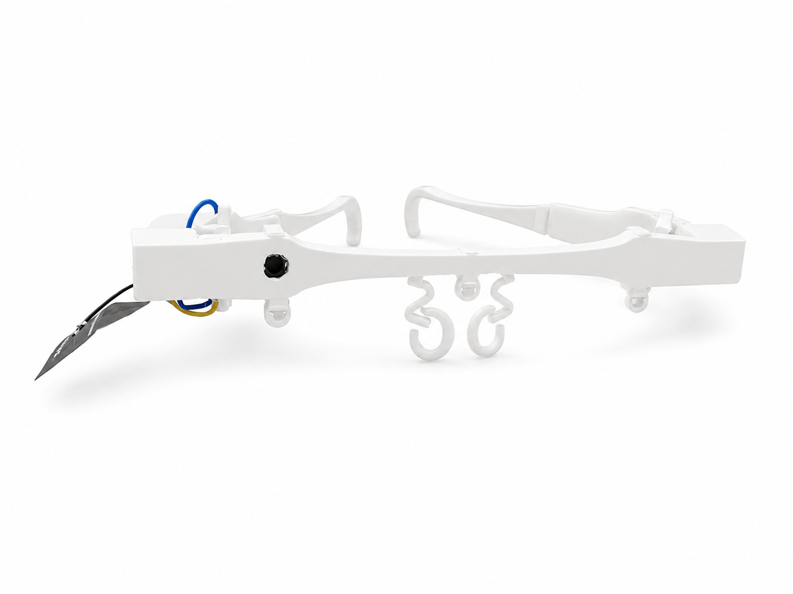
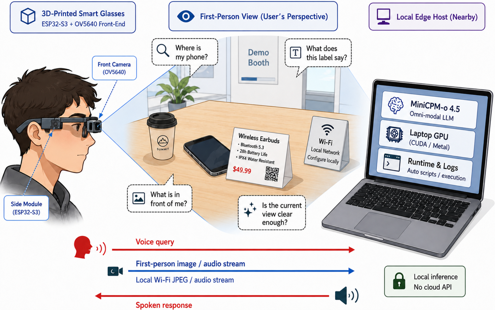
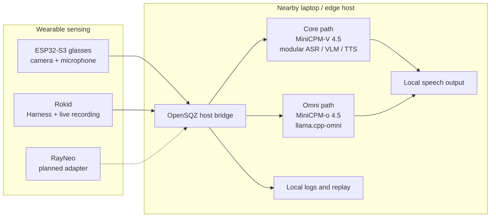

# OpenSQZ Glass

### Wearable sensing. Nearby local intelligence.

**An open-source research platform for local-first visual assistance, connecting lightweight first-person sensing with multimodal inference on a nearby laptop or edge host.**

[中文](README_zh.md) · [Setup and Run](#setup-and-run) · [Hardware Guide](hardware/AI_GLASSES_OPEN_SOURCE_REPORT_EN.md) · [ACL 2026 Paper](https://aclanthology.org/2026.acl-demo.82/) · [Safety & Privacy](docs/safety_privacy.md) · [Roadmap](docs/roadmap.md)




*OpenSQZ Glass 3D-printed frame and sensing hardware.*

> The glasses capture first-person images and audio. A nearby computer runs model inference and generates speech.

## News

- **[2026.09.30]** 📢📢📢 We integrated **Harness with MiniCPM-o** for voice-controlled conversations and added **Rokid glasses support**, including wireless audio/video streaming, one-click panel startup, and local recording. [Get started](#setup-and-run).
- **[2026.08.04]** 📢📢📢 We introduce **OpenSQZ Glass** as the umbrella project for our sensing hardware, local multimodal runtimes, and related research tracks. [Explore the project](#overview).
- **[2026.08.03]** 🥳🥳🥳 We integrated the experimental [OmniRuntime](runtime/openglass_omni/README.md), including the control panel, ESP32 bridge, prompt switching, and local session recording/replay tools. [Try it now!](#setup-and-run)
- **[2026.07.22]** 🔥🔥🔥 We open-source the complete first hardware release: an [editable STEP frame](hardware/cad_3d_print/A02_frame_source.step), [3MF print plate](hardware/cad_3d_print/A03_print_plate.3mf), [bill of materials (BOM)](hardware/bom/A01_bom_public.xlsx), project images, and a [bilingual build guide](hardware/AI_GLASSES_OPEN_SOURCE_REPORT_EN.md). Try it out!
- **[2026.07.21]** ⭐️⭐️⭐️ OpenSQZ Glass was demonstrated at **WAIC 2026** and featured by InfoQ in [*OpenSQZ Glass: Bringing End-Side Full-Duplex Omnimodal Models into the First-Person Wearable World*](https://www.infoq.cn/article/UZ1j5LXmjNgiCfu5QL0s).
- **[2026.07.20]** 🚀🚀🚀 Our 3D-printed wearable hardware demo, **OmniGlass-Edge**, was accepted to [UbiComp/ISWC 2026](https://www.ubicomp.org/ubicomp-iswc-2026/) Posters & Demos! See the [open hardware guide](hardware/AI_GLASSES_OPEN_SOURCE_REPORT_EN.md).
- **[2026.07]** 📄📄📄 Our ACL 2026 System Demonstration paper, [*OpenGlass: A Sensing-Computing Split Architecture for Local MLLM-Driven Real-Time Visual Assistance*](https://aclanthology.org/2026.acl-demo.82/), is now available in the ACL Anthology. [Read the paper](papers/acl2026.md).
- **[2026.04.26]** 🎉🎉🎉 Our **OpenGlass sensing-computing split system**, one research track within the broader OpenSQZ Glass project, was accepted to the [ACL 2026 System Demonstrations](https://aclanthology.org/2026.acl-demo.82/) track!
- **[2026.03.03]** 🔥🔥🔥 The OpenGlass repository is officially released with ESP32 sensing firmware and evaluation scripts. [Try it out!](#setup-and-run)

## Overview

OpenSQZ Glass provides wearable capture, local multimodal inference and voice interaction components for ESP32-based glasses and Rokid glasses.



*System overview adapted from Figure 1 of the UbiComp/ISWC paper.*

| On the glasses | On the nearby host | In this repository |
| --- | --- | --- |
| ESP32-S3 camera and PDM microphone capture first-person context | A laptop or edge host runs ASR/VLM/TTS or MiniCPM-o locally | Firmware, host bridges, evaluation tools, experimental runtime, session replay, and hardware documentation |

The host supports MiniCPM-V with separate ASR/TTS components and MiniCPM-o multimodal conversation. The instructions below cover the MiniCPM-o panel; research references are listed under Publications.


```mermaid
flowchart LR
  subgraph D["Wearable sensing"]
    ESP["ESP32-S3 glasses\ncamera + microphone"]
    ROKID["Rokid\nHarness + live recording"]
    RAYNEO["RayNeo\nplanned adapter"]
  end

  ESP --> BRIDGE["OpenSQZ host bridge"]
  ROKID --> BRIDGE
  RAYNEO -.-> BRIDGE

  subgraph H["Nearby laptop / edge host"]
    BRIDGE --> CORE["Core path\nMiniCPM-V 4.5\nmodular ASR / VLM / TTS"]
    BRIDGE --> OMNI["Omni path\nMiniCPM-o 4.5\nllama.cpp-omni"]
    CORE --> OUT["Local speech output"]
    OMNI --> OUT
    BRIDGE --> SESSION["Local logs and replay"]
  end
```

Solid arrows indicate integrated devices; dashed arrows indicate planned adapters.

## Setup and Run

After preparing the environment and device, use the panel to start the services together. ESP32 and Rokid share the host backend; follow the device-specific branch for your glasses.

### 1. Requirements

The steps below use Windows, Conda/Python and an NVIDIA GPU. Building the backend requires Visual Studio 2022 C++ Build Tools, CMake and a compatible CUDA environment. Match Python and dependency versions to your upstream checkout.

- **ESP32:** Arduino IDE, ESP32 board support and a USB data cable.
- **Rokid:** Android Platform Tools (ADB), Android SDK and JDK 17 for building the sensor app.
- **Functional conversation:** a local FunASR model for Harness voice control.
- **MP4 recording:** FFmpeg on the PATH used to launch the panel.

The glasses and PC must be reachable over the network. Prepare model weights, MiniCPM-o-Demo and llama.cpp-omni outside this repository.

### 2. Prepare the shared backend

Keep OpenGlass, MiniCPM-o-Demo and llama.cpp-omni in separate directories. The panel locates them through local configuration. The V2 startup order is `llama-omni-server`, `worker`, then `gateway`; the panel also starts the device adapter.

```powershell
# Clone the llama.cpp-omni backend for MiniCPM-o
git clone --branch master https://github.com/tc-mb/llama.cpp-omni.git
# Build the inference server with CUDA support
cd llama.cpp-omni
cmake -B build -DCMAKE_BUILD_TYPE=Release -DGGML_CUDA=ON -DLLAMA_CURL=OFF
cmake --build build --config Release --target llama-omni-server -j
cd ..

# Clone MiniCPM-o-Demo (including worker and gateway)
git clone --branch master https://github.com/OpenBMB/MiniCPM-o-Demo.git
cd MiniCPM-o-Demo
# Install MiniCPM-o-Demo dependencies
python -m pip install -r requirements.txt
cd ..

# Clone OpenGlass
git clone https://github.com/OpenSQZ/OpenGlass.git
cd OpenGlass
# Install OpenGlass runtime dependencies
python -m pip install -r runtime/openglass_omni/requirements.txt
```

#### Model files

Store the MiniCPM-o 4.5 GGUF modules together outside the repository. The launcher passes the main model via `-m`; follow your llama.cpp-omni version's layout for vision, audio, TTS and Token2Wav:

```text
MiniCPM-o-4_5-gguf/
├── MiniCPM-o-4_5-Q4_K_M.gguf
├── vision/
├── audio/
├── tts/
└── token2wav-gguf/
```

See the upstream [prerequisites](https://github.com/tc-mb/llama.cpp-omni#prerequisites) for downloads and exact filenames.

#### OpenGlass dependencies and ASR

Use the same Conda environment as MiniCPM-o-Demo. From the OpenGlass root:

```powershell
python -m pip install -r runtime/openglass_omni/requirements.txt
python -m pip install -r extensions/assistive_harness/phase_b/requirements-phase-b.txt
```

The functional dependency file also includes ESP32 image-selection components. Download the FunASR model named in the configuration example and set its directory as `asr_model` below.

### 3. Prepare your glasses

#### ESP32: flash firmware and obtain the IP

1. Assemble the glasses using the [hardware guide](hardware/AI_GLASSES_OPEN_SOURCE_REPORT_EN.md).
2. Open [CameraWebServer_PDM_Audio.ino](CameraWebServer_PDM_Audio/CameraWebServer_PDM_Audio.ino), enter your Wi-Fi name/password, select the matching ESP32-S3 board and upload.
3. Open Serial Monitor at `115200` baud and note the IP assigned after connecting. Enter it in the device registry in the next step.

#### Rokid: install the sensor app and enable USB debugging

**Phone setup**

Install the official Rokid AI phone app and connect your glasses. In settings, enable developer mode and authorize glasses ADB debugging.

**Build and install the sensor app**

Source is in [rokid_app/OpenGlassRokidSensor](rokid_app/README.md). Install Android SDK and JDK; Gradle dependencies download during the first build.

Sensor app **0.1.3 accepts the PC address from the panel at launch**. No PC IP is needed at build time; configure it locally after installation.

From the OpenGlass root:

```powershell
# Connect USB and obtain the serial with adb devices -l
.\rokid_app\build_install.cmd -Sdk "<ANDROID_SDK_PATH>" -Install -Serial "<USB_SERIAL>"
```

Omit `-Install` to build only. Equivalent Gradle/ADB commands are in the [sensor app guide](rokid_app/README.md).

Allow camera and microphone permissions and configure Wi-Fi through the device or companion app. See Troubleshooting below for installation errors. Keep USB connected for the first panel startup until wireless initialization is complete.

### 4. Configure OpenGlass

Run these commands from the repository root. Copy the template on first setup; edit an existing local file rather than overwriting it:

```powershell
Copy-Item runtime/openglass_omni/runtime.example.json runtime/openglass_omni/runtime.local.json
```

Set your local paths:

| Key | Value |
| --- | --- |
| `minicpm_demo_root` | MiniCPM-o-Demo directory containing `worker.py` and `gateway.py` |
| `llama_server` | Built `llama-omni-server.exe` |
| `llama_model` | Main GGUF model |
| `asr_model` | Local FunASR model directory |
| `conda_env` | Named environment; leave empty to use the externally activated environment |

The panel loads `runtime.local.json` at startup. Restart it after configuration changes; use the default ports for initial setup.

**ESP32 device registry**

```powershell
Copy-Item examples/configs/devices.example.json runtime/openglass_omni/devices.json
```

Fill in the device name, `esp32_host` obtained above, HTTP port and clockwise camera rotation `rotate` (0, 90, 180 or 270).

**Rokid settings**

Add or update these fields in the complete local configuration:

```json
{
  "rokid_mode": "wifi",
  "rokid_adb": "<ADB_EXE_ABSOLUTE_PATH>",
  "rokid_serial": "",
  "rokid_adb_addr": "",
  "rokid_pc_url": "http://<PC_LAN_IP>:18080"
}
```

Use `ipconfig` to find the PC IPv4 reachable from the glasses. `rokid_pc_url` is the **PC ingest address**; `rokid_adb_addr` is the **glasses wireless debugging address**, established and saved by the panel. With one pair of glasses, `rokid_serial` can be empty.

After changing networks, configure Wi-Fi on the glasses, update the local PC URL and restart the panel. The panel enables Wi-Fi and reconnects a saved network.

### 5. Start and stop

Activate the prepared Conda environment and run from the OpenGlass root:

```powershell
python glasses_panel.py
```

Choose a mode and, for ESP32, a device. Click Start All; the panel waits for each service in sequence:

```text
llama-omni-server :22500 → worker :22400 → gateway :8006
                                            ├─ ESP32 basic adapter
                                            └─ Harness :8021 → ESP32 / Rokid functional adapter
Live view :8080; Rokid sensor input :18080
```

Open the live view, confirm that frames update and speak to test a response.

**First Rokid wireless setup:** keep USB attached while the panel enables Wi-Fi, waits for an address, connects wireless ADB and launches the sensor. Unplug after logs confirm wireless ADB and both image/audio input work. If initialization fails, keep USB attached and check glasses Wi-Fi.

**Optional: play audio through Rokid glasses.** Pair your Rokid glasses with the PC over Bluetooth and select them as the audio output device before starting the panel. This can reduce speaker audio being picked up again by the glasses’ microphone.

Later panel or PC restarts reuse the saved address. If a glasses restart breaks wireless access, follow Troubleshooting below.

Click Stop All when finished and wait for session cleanup and recording export before closing the window. See the [startup guide](runtime/openglass_omni/STARTUP_en.md) for details.

## Usage and Configuration

### Panel modes

| Menu entry | Function |
| --- | --- |
| ESP32基础对话 | Basic ESP32 multimodal conversation, without Harness or image selection. |
| ESP32功能对话 | Harness voice control and image quality filtering; rejection does not automatically pause conversation or play a warning. |
| Rokid功能对话 | Rokid input and Harness voice control, without the ESP32 image-selection funnel. |

Harness provides pause, resume, restart and skills such as object finding, text reading and scene description. Activation phrases and task prompts are configurable.

### Phrases and prompts

**Activation phrases** determine which utterances trigger controls or skills. Copy the example, edit the local file and restart Harness:

```powershell
Copy-Item runtime/openglass_omni/voice_commands.example.yaml runtime/openglass_omni/voice_commands.local.yaml
```

**Skill prompts** determine how the model performs a task. Edit files such as `find_object_zh.txt` and `read_text_zh.txt` in [prompts](extensions/assistive_harness/prompts/), then reactivate the skill or create a new session.

**Panel idle-chat prompts** come from `CONFIG["presets"]` in `panel.py`. The Rokid `--prompt` overrides `idle_chat_zh.txt`; editing only that file may not change panel chat behavior.

### Recording and replay

Use `--record-live` with `--ui-port 8080` in the Rokid command. Recordings go to `live_sessions/rokid_<timestamp>/`; `--live-record-dir` changes the parent directory.

Normal stop saves user/model WAV files, closes services and exports `live_session.mp4` using FFmpeg on PATH. Without FFmpeg, WAV and images remain available. Left/right channels contain user/model audio respectively.

Live view: `http://localhost:8080/`. Replay: `http://localhost:8080/replay`, while the corresponding UI service is running. ESP32 recording and command-line replay are described in the [runtime guide](runtime/openglass_omni/README.md).

Audio is written on stop. Use the page stop button or panel Stop All and wait for export to finish.

## Hardware

Frame designs, print files and materials:

- [Hardware guide](hardware/AI_GLASSES_OPEN_SOURCE_REPORT_EN.md)
- [Hardware overview](hardware/README.md)
- [Editable STEP and 3MF print plate](hardware/cad_3d_print/README.md)
- [Bill of materials](hardware/bom/README.md)
- [Safety and privacy](docs/safety_privacy.md)

Use STEP to modify the frame, 3MF for the print layout and the BOM for component selection.

## Repository Structure

```text
OpenGlass/
├── glasses_panel.py                 # Panel entry
├── runtime/openglass_omni/          # Panel, device startup, configuration and guides
├── rokid_app/                      # Sensor app source and build/install scripts
├── extensions/assistive_harness/    # ASR, controls, prompts and device adapters
├── CameraWebServer_PDM_Audio/       # ESP32 camera/PDM firmware
├── eval_benchmark/                 # Evaluation and latency scripts
├── hardware/                       # CAD, BOM and assembly
├── papers/                         # Publications
├── docs/                           # Architecture and roadmap
└── examples/configs/               # Configuration examples
```

## Troubleshooting

### Rokid APK installation is denied or signatures differ

For `not allow package install!`, check companion-app developer mode and glasses debugging/install authorization.

For `INSTALL_FAILED_UPDATE_INCOMPATIBLE`, use the original signing key to build the update, or uninstall the old collector if its data is no longer needed. Uninstallation clears its settings and permissions; grant camera/microphone permissions again after installing.

### Wireless access fails after restarting the glasses

Reconnect USB, authorize debugging and start from the panel. It enables Wi-Fi, waits for the saved network and re-establishes wireless ADB. Reinstalling the sensor app is unnecessary.

### Services start, but no image or audio arrives

For Rokid, inspect `image_count` and `audio_packets_in` at `http://127.0.0.1:18080/health`. If both remain zero, check glasses networking, the PC URL and Windows inbound TCP 18080 rules for the active Python executable.

For ESP32, compare `devices.json` with the IP printed by the firmware and confirm network connectivity.

### No MP4 appears after stopping

Look for `live_user.wav`, `live_ai.wav` and images. If present, run `ffmpeg -version` in the panel terminal and inspect recording logs for export errors. If WAV files are also missing, check whether the process stopped normally: force-killing can lose audio still in memory.

### The inference backend exits after a session restart

When the backend exits, restart the full service chain; reconnecting the glasses alone will not restore inference:

1. Click Stop All and wait for the services to stop.
2. Click Start All and wait for llama, worker, gateway and the device adapter to become ready.
3. Confirm that the live view updates, then begin a new conversation.

## Publications

The ACL 2026 paper describes OpenGlass's sensing-computing split architecture and visual assistance applications.

- **Title:** OpenGlass: A Sensing-Computing Split Architecture for Local MLLM-Driven Real-Time Visual Assistance
- **Authors:** Mengzhang Li and Yuan Yao
- **Venue:** ACL 2026 System Demonstrations, pages 829–839

[ACL Anthology](https://aclanthology.org/2026.acl-demo.82/) · [PDF](https://aclanthology.org/2026.acl-demo.82.pdf) · [DOI](https://doi.org/10.18653/v1/2026.acl-demo.82)

```bibtex
@inproceedings{li2026openglass,
  title={OpenGlass: A Sensing-Computing Split Architecture for Local MLLM-Driven Real-Time Visual Assistance},
  author={Li, Mengzhang and Yao, Yuan},
  booktitle={Proceedings of the 64th Annual Meeting of the Association for Computational Linguistics (Volume 3: System Demonstrations)},
  pages={829--839},
  year={2026}
}
```

## License and Contributing

OpenSQZ Glass is licensed under [Apache License 2.0](https://www.apache.org/licenses/LICENSE-2.0).

Issues and pull requests are welcome at [OpenSQZ/OpenGlass](https://github.com/OpenSQZ/OpenGlass). For runtime issues, include the device model, environment, versions, reproduction steps and incident time, together with relevant excerpts from the panel, device adapter (Rokid or ESP32), Harness, gateway, worker and llama logs for that period. Remove credentials and personal information before sharing.
