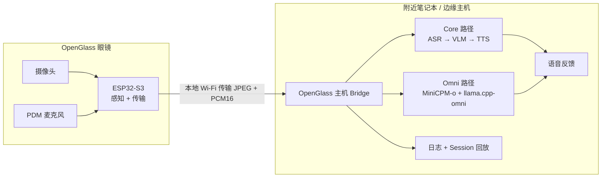

<div align="center">

# OpenGlass

### 一副轻量眼镜，一台附近设备，本地完成实时视觉辅助

**一个将可穿戴感知与附近设备多模态推理解耦的开放研究平台。**

[English](README.md) · [快速开始](docs/quickstart.md) · [硬件](hardware/README.md) · [Omni Runtime](runtime/openglass_omni/README.md) · [论文](papers/acl2026.md) · [安全](docs/safety_privacy.md)

[](https://github.com/OpenSQZ/OpenGlass/stargazers)


<br>


</div>

> [!IMPORTANT]
> **大型多模态模型不运行在 ESP32 眼镜上。** OpenGlass 采用“感知-计算分离”架构：眼镜采集第一视角图像和声音，附近的笔记本电脑或边缘主机在本地完成推理与语音生成。

## 为什么做 OpenGlass

第一视角视觉辅助同时需要可穿戴形态、及时的多模态理解，以及对私密图像和声音的谨慎处理。ESP32 很适合感知，却无法承载大型多模态模型；完全依赖云端又增加了新的隐私和延迟边界。

OpenGlass 让眼镜保持轻量，把计算留在身边：

| 可穿戴感知 | 附近设备本地推理 | 可复现研究 |
| --- | --- | --- |
| ESP32-S3 摄像头、PDM 麦克风、Wi-Fi 传输 | 模块化 ASR/VLM/TTS 或实验性 MiniCPM-o Runtime | 固件、评测工具、延迟日志、Session 回放和硬件开源工作 |

这让 OpenGlass 能用于本地优先视觉辅助研究，同时不会误导读者认为模型运行在眼镜本体上。

## 可以探索什么

| 寻找物品 | 读取文字 | 描述场景 | 研究实时交互 |
| --- | --- | --- | --- |
| 让系统从第一视角画面中寻找指定物品 | 在画面清晰时读取标牌、标签与文档 | 生成简短、基于画面证据的场景描述 | 测量流式延迟、Prompt 切换、多轮、打断和回放行为 |

所有输出都可能出错。OpenGlass 不是认证导航设备、医疗器械或安全关键系统。

## 工作原理



当前仓库中的固件提供：

| 接口 | 地址 | 用途 |
| --- | --- | --- |
| HTTP | `http://<ESP32_IP>/capture` | 抓取单张 JPEG |
| HTTP | `http://<ESP32_IP>:81/stream` | MJPEG 预览流 |
| WebSocket | `ws://<ESP32_IP>/ws_audio` | PCM16 麦克风音频流 |

实验性 Bridge 也支持 `/ws_audio_v2`；请选择与你实际烧录固件一致的端点。

## 三条项目线，一个 OpenGlass

| 项目线 | 仓库内容 | 状态 |
| --- | --- | --- |
| **OpenGlass-Core** | ESP32-S3 感知固件、附近主机 ASR/VLM/TTS 实验、评测与延迟工具 | 已提供 |
| **OpenGlass-Hardware** | [AI 智能眼镜开源报告](hardware/AI_GLASSES_OPEN_SOURCE_REPORT.md)、3D 打印镜架、CAD/STL/3MF、BOM、走线、装配、打印与验证文档 | 发布包核验中 |
| **OpenGlass-OmniRuntime** | 围绕外部 MiniCPM-o-Demo 与 llama.cpp-omni checkout 的独立面板、ESP32 Bridge、Prompt 切换、录制与回放 | 实验性；本机烟测通过 |

## 快速开始

先克隆 OpenGlass：

```bash
git clone https://github.com/OpenSQZ/OpenGlass.git
cd OpenGlass
```

然后选择你要测试的路径。

### 1. 不接眼镜，先跑通评测管线

这条路径不需要硬件，也不会调用云端 API。当前 `cloud_api.yaml` 使用仓库内的 stub adapter，用于检查 manifest、指标和运行产物。

```bash
python -m venv .venv
# Windows: .venv\Scripts\activate
# Linux/macOS: source .venv/bin/activate
python -m pip install -r eval_benchmark/requirements.txt
python -m eval_benchmark.src.run_eval --config eval_benchmark/configs/cloud_api.yaml
```

如需真实本地推理，请先单独启动 OpenAI-compatible VLM 服务，并在选择非 stub 配置前阅读 [`eval_benchmark/README.md`](eval_benchmark/README.md)。

### 2. 烧录并测试 ESP32 感知固件

1. 在 Arduino IDE 打开 [`CameraWebServer_PDM_Audio.ino`](CameraWebServer_PDM_Audio/CameraWebServer_PDM_Audio.ino)，并按照[固件配置说明](CameraWebServer_PDM_Audio/README.md)操作。
2. 选择 XIAO ESP32-S3 开发板与匹配的摄像头配置。
3. 只在本地替换 `YOUR_WIFI_NAME` 和 `YOUR_WIFI_PASSWORD`，不要提交真实凭据。
4. 编译、烧录并打开串口监视器。
5. 把串口输出的 DHCP 地址记为 `<ESP32_IP>`，在本地网络测试 `/capture`、`:81/stream` 和 `/ws_audio`。设备重启后该地址可能变化。

当前固件中的 PDM 映射为 `IO42 = CLK`、`IO41 = DATA`。上电前请对照你的实物版本再次确认。

### 3. 启动实验性 Omni 控制面板

OpenGlass 不把上游源码复制进本仓库。请将上游项目克隆到仓库外部：

```bash
git clone --branch feat/web-demo https://github.com/tc-mb/llama.cpp-omni.git
git clone --branch Comni https://github.com/OpenBMB/MiniCPM-o-Demo.git
```

按照上游说明完成一次 llama.cpp-omni 编译，配置 MiniCPM-o-Demo 中被忽略的 `config.json`，再创建 OpenGlass 本地适配配置：

```bash
python -m pip install -r <MINICPM_O_DEMO_ROOT>/requirements.txt
python -m pip install -r runtime/openglass_omni/requirements.txt
cp runtime/openglass_omni/runtime.example.json runtime/openglass_omni/runtime.local.json
cp examples/configs/devices.example.json runtime/openglass_omni/devices.local.json

python glasses_panel.py --check
python glasses_panel.py
```

把 `devices.local.json` 中的示例 `esp32_host` 换成串口显示的 `<ESP32_IP>`，并让 `runtime.local.json` 的 `devices_file` 保持为 `devices.local.json`。Windows PowerShell 请把 `cp` 换成 `Copy-Item`。Launcher 会复用已有的 llama.cpp-omni 编译产物，不会替你 clone、更新或编译上游仓库。完整说明见 [Omni Runtime 教程](runtime/openglass_omni/README.md)。

### 面板按钮语义

| 操作 | 实际行为 |
| --- | --- |
| **一键启动** | 依次启动 upstream worker、upstream gateway 和 OpenGlass ESP32 Bridge |
| **重启 / 停止** | 只重启或停止 OpenGlass Bridge，模型保持热启动 |
| **全部重启 / 全部停止** | 操作三个托管进程；停止 worker 时也会停止其 llama-server 子进程 |
| **应用 Prompt** | 只用当前 Prompt 重启 OpenGlass Bridge |

## 硬件制作路线

硬件部分会以版本化、可复现的方式发布，而不是简单丢下一批没有说明的打印文件。

```text
CAD 源文件 → 审核后的 STL → 3MF 打印盘 → 脱敏 BOM
          → 走线 + 引脚图 → 装配 → 固件测试 → 端到端验证
```

| Artifact | 公开状态 |
| --- | --- |
| 可编辑 STEP / 3MF 源文件 | 内部源材料中存在；等待发布审核 |
| STL 导出 | 尚未公开 |
| BOM 表格 | 源材料中存在；等待规格与购买链接脱敏 |
| 走线 / 装配教程 | 准备中 |
| 照片与视频 | 有候选材料；等待隐私和使用权审核 |
| 电池、充电、温度与舒适性结果 | 需要人工核验 |

请从[硬件总览](hardware/README.md)开始，再查看持续完善中的 [CAD 与 3D 打印](hardware/cad_3d_print/README.md)、[BOM](hardware/bom/README.md)和[安全边界](docs/safety_privacy.md)。不要仅根据草稿说明制作或佩戴未经验证的电池供电原型。

## 仓库结构

```text
OpenGlass/
├── CameraWebServer_PDM_Audio/   # ESP32-S3 摄像头 + PDM 麦克风固件
├── eval_benchmark/              # 评测、延迟、Baseline 与 Omni Harness
├── runtime/openglass_omni/      # 实验性独立 Omni 适配层与 UI
├── hardware/                    # CAD/BOM/装配发布文档
├── docs/                        # 架构、快速开始、安全与路线图
├── papers/                      # 论文页面与引用状态
├── examples/configs/            # 脱敏的本地配置示例
└── assets/                      # 候选公开图表与原型媒体
```

## 文档入口

| 我想要…… | 从这里开始 |
| --- | --- |
| 理解设计 | [项目概览](docs/overview.md) · [架构](docs/architecture.md) |
| 运行软件 | [快速开始](docs/quickstart.md) · [Omni Runtime](runtime/openglass_omni/README.md) |
| 制作眼镜 | [AI 智能眼镜开源报告](hardware/AI_GLASSES_OPEN_SOURCE_REPORT.md) · [CAD/打印](hardware/cad_3d_print/README.md) · [BOM](hardware/bom/README.md) |
| 运行评测 | [评测 README](eval_benchmark/README.md) · [评分规则](eval_benchmark/rubric_nlp_v3.md) |
| 准备发布 | [路线图](docs/roadmap.md) · [发布检查表](docs/release_checklist.md) |
| 设计用户测试 | [安全与隐私](docs/safety_privacy.md) |

## 当前边界

- 模型推理运行在附近主机上，绝不运行在 ESP32 眼镜中。
- Omni Runtime 仍是实验性集成，不是生产就绪的技能平台。
- Session 一键 rerun UI、skill 导入/重启和长时间会话可靠性仍未解决。
- 当前公开包不包含 Rokid 源码或 APK。
- 硬件命名、BOM、电池、充电、自动对焦、舒适性和打印参数仍需核验。
- 本仓库不 vendoring 模型权重、私密录制、凭据、真实设备地址或上游仓库。

## 安全与隐私

OpenGlass 是研究原型，可能出错、延迟、遗漏或不可用。不要依赖它过马路、避让车辆、作医疗决定、进入危险区域或完成其他安全关键任务。

第一视角摄像头和麦克风可能拍到旁人、屏幕、文档、住宅、工作场所和位置线索。本地推理减少了默认数据暴露，但不是隐私保证。请检查并尽量减少保存的图像、声音、转写和日志。面向用户测试前请完整阅读[安全与隐私说明](docs/safety_privacy.md)。

## 参与贡献

目前尤其需要这些贡献：

- Windows、Linux 和不同 GPU 上的干净机器复现。
- ESP32 `/ws_audio` 与 Runtime `/ws_audio_v2` 的协议对齐。
- Session rerun UI 与保护隐私的回放工具。
- 带有明确实验性标注的 skill 重启/导入接口。
- 脱敏的 CAD、STL、3MF、BOM、走线、装配和验证资料。
- 来自盲人和低视力用户的可访问性反馈与受控研究。

请勿提交模型权重、私密录制、凭据、个人数据、原始私密日志或未公开投稿材料。

## 论文

**OpenGlass: A Sensing-Computing Split Architecture for Local MLLM-Driven Real-Time Visual Assistance**<br>
Mengzhang Li and Yuan Yao · ACL 2026 System Demonstrations

官方论文元数据与最终 BibTeX 仍等待公开核验。请查看 [`papers/acl2026.md`](papers/acl2026.md)，不要编造 Anthology 链接、DOI、页码或数值结果。

## 上游项目

OpenGlass 选择与上游项目集成，而不是把它们 vendoring 到本仓库中，包括 [MiniCPM-o](https://github.com/OpenBMB/MiniCPM-o)、[MiniCPM-o-Demo](https://github.com/OpenBMB/MiniCPM-o-Demo)、[llama.cpp-omni](https://github.com/tc-mb/llama.cpp-omni) 和更广泛的 [llama.cpp](https://github.com/ggml-org/llama.cpp) 生态。

## 许可

当前分支尚未包含仓库 License。在项目所有者正式发布许可前，请不要假定代码或资产可以重新分发或复用。

<div align="center">

**可穿戴感知。附近设备本地推理。开放研究。**

</div>
