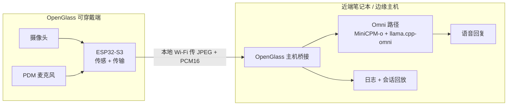

<div align="center">

# OpenGlass

### 轻量眼镜上的本地优先视觉辅助

**一个开放的研究平台，把可穿戴端的传感与近端设备上的多模态推理解耦。**

[English](README.md) · [快速上手](docs/quickstart.md) · [硬件](hardware/README.md) · [Omni 运行时](runtime/openglass_omni/README.md) · [论文](papers/acl2026.md) · [安全](docs/safety_privacy.md)


<br>


</div>

> [!IMPORTANT]
> **大模型不在 ESP32 眼镜上运行。** OpenGlass 采用传感—计算分离：可穿戴端采集第一视角的图像/音频流，由近端的笔记本或边缘主机在本地完成推理与语音生成。

## 为什么做 OpenGlass

第一视角的视觉辅助需要同时满足三件事：可穿戴的形态、响应及时的多模态推理、以及对私密的摄像头/音频数据的谨慎处理。ESP32 级别的可穿戴设备擅长传感，但无法承载大模型；纯云端推理又多了一层信任与延迟边界。

OpenGlass 让眼镜保持轻量、让算力靠近：

| 可穿戴传感 | 近端设备本地推理 | 可复现研究 |
| --- | --- | --- |
| ESP32-S3 摄像头、PDM 麦克风、Wi-Fi 传输 | 模块化 ASR/VLM/TTS，或实验性的 MiniCPM-o 运行时 | 固件、评测工具、延迟日志、会话回放、硬件发布材料 |

这让 OpenGlass 适合研究"本地优先的视觉辅助"，而不必假装模型跑在可穿戴端上。

## 你可以探索什么

| 找东西 | 念可见文字 | 描述场景 | 研究实时交互 |
| --- | --- | --- | --- |
| 说出要找的物品，在第一视角画面里检索 | 画面清晰时读出标牌、标签、文档 | 给出简短、基于证据的场景描述 | 测量流式延迟、prompt 切换、多轮行为、打断、回放 |

所有输出都可能出错。OpenGlass 不是经过认证的导航辅助、医疗设备或安全关键系统。

## 工作原理



可穿戴端只负责传感与推流；近端主机上的面板负责拉起模型后端，并把眼镜桥接到它。

## 三条线，一个项目

| 线 | 内容 | 状态 |
| --- | --- | --- |
| **OpenGlass-Core** | ESP32-S3 传感固件、近端主机实验、评测与延迟工具 | 可用 |
| **OpenGlass-Hardware** | 可打印镜架、CAD/STL/3MF、BOM、接线、装配与验证文档 | 发布包验证中 |
| **OpenGlass-OmniRuntime** | 围绕外部 MiniCPM-o-Demo 与 llama.cpp-omni 的独立面板、ESP32 + Rokid 桥接、prompt 切换、录制与回放 | 实验性；已在维护者机器上验证可跑 |

---

## 快速上手 —— Omni 控制面板

这是端到端流程：编译模型后端、拉起上游服务、烧录眼镜，然后用面板统一驱动。

> 面板是一个轻量启动器。它按顺序拉起并监管四个进程（`llama-omni-server` → `worker` → `gateway` → `demo`），并显示眼镜的第一视角。**它不会替你 clone、编译或配置上游的模型项目** —— 这些你按下面的步骤配置一次即可。

### 第 1 步 —— 编译 llama.cpp-omni（模型后端）

Clone 并编译 [llama.cpp-omni](https://github.com/tc-mb/llama.cpp-omni)（`master` 分支）。Windows 上推荐用 *x64 Native Tools Command Prompt for VS 2022*；不需要 CURL。

```bash
git clone https://github.com/tc-mb/llama.cpp-omni
cmake -B build -DCMAKE_BUILD_TYPE=Release -DGGML_CUDA=ON -DLLAMA_CURL=OFF
cmake --build build --config Release --target llama-omni-server -j
```

编译成功会产出 `build/bin/Release/llama-omni-server.exe`。

准备 MiniCPM-o 模型权重（从 Hugging Face 下载），按如下目录结构摆放：

```text
<model_root>/
├── MiniCPM-o-4_5-Q4_K_M.gguf
├── vision/MiniCPM-o-4_5-vision-F16.gguf
├── audio/MiniCPM-o-4_5-audio-F16.gguf
├── tts/MiniCPM-o-4_5-tts-F16.gguf
├── tts/MiniCPM-o-4_5-projector-F16.gguf
└── token2wav-gguf/
```

可以先直接启动后端做冒烟测试（之后面板会通过 worker 间接拉起它）：

```bash
llama-omni-server.exe -m <gguf 路径> -ngl 99 --host 127.0.0.1 --port 22500 --ctx-size 8192
```

### 第 2 步 —— 配置 MiniCPM-o-Demo（worker + gateway）

Clone [MiniCPM-o-Demo](https://github.com/OpenBMB/MiniCPM-o-Demo)（`master` 分支）并装依赖：

```bash
git clone https://github.com/OpenBMB/MiniCPM-o-Demo
cd MiniCPM-o-Demo
pip install -r requirements.txt
```

先单独验证上游服务能跑通，再让面板介入：

```bash
# 1) 后端（来自 llama.cpp-omni 的编译产物）
llama-omni-server.exe -m <gguf 路径> -ngl 99 --host 127.0.0.1 --port 22500 --ctx-size 8192
# 2) worker（等到后端 /health 就绪）
python worker.py --host 0.0.0.0 --port 22400 --gpu-id 0 --backend-server-url http://127.0.0.1:22500
# 3) gateway
python gateway.py
```

> [!WARNING]
> **务必使用 `master` 分支。** 该版本worker 才认 `--backend-server-url`（用来连独立的 llama-omni-server）。其他分支（Comni/cpp-backend）的 worker 不认这个参数，会报 `unrecognized arguments: --backend-server-url` 并退出。

> [!WARNING]
> **修掉 300 秒自动断连。** gateway 代码里，video duplex 模式 300 秒后会结束并断开连接。把：
>
> ```python
> max_duration_s = 300 if mode == "video" else 600
> ```
> 改成：
> ```python
> max_duration_s = None if mode == "video" else 600
> ```

打开 `http://localhost:8006`，确认能用 PC 自带的摄像头和麦克风与模型对话。这一步通了，说明上游的 `worker.py` + `gateway.py` 路径没问题 —— 面板依赖的正是这条路径。

### 第 3 步 —— 安装 OpenGlass（作为独立目录）

把本仓库 clone 到独立位置（**不需要**放进 MiniCPM-o-Demo 里面），并把依赖装进你将用来跑面板的**同一个**环境：

```bash
git clone <本仓库> OpenGlass
cd OpenGlass
pip install -r requirements.txt
```

然后打开 `runtime/openglass_omni/panel.py`，设置 `CONFIG` 里的路径（都标了 `<PATH_TO>`）：

- **`procs["llama"]`** —— `llama-omni-server.exe` 路径 与 `-m` 的 GGUF 路径（来自第 1、2 步）。
- **`minicpm_demo_dir`** —— MiniCPM-o-Demo 目录（`worker.py` / `gateway.py` 所在处）。面板会**在该目录下**启动 worker 与 gateway，所以必须指向你的 MiniCPM-o-Demo，例如 `r"D:\MiniCPM-o-Demo"`。

确认 ESP32 眼镜与 PC 在**同一 Wi-Fi**，在 Arduino IDE 串口监视器里看到眼镜 IP（例如 `192.168.10.174`），并确认浏览器能看到它的视频流。

编辑 `runtime/openglass_omni/devices.json` —— 给每副眼镜起名、填 IP 和默认旋转角。名字随意；启动后在面板里选：

```json
{
  "_comment": "每副眼镜一条。烧录后从串口监视器读到 IP 填进 esp32_host。rotate 是该眼镜摄像头顺时针旋转角度(0/90/180/270)，按设备物理安装方向填。每台笔记本各自维护一份。gateway 端口不在这里配。",
  "devices": [
    { "name": "left",  "esp32_host": "192.168.10.174", "esp32_port": 80, "rotate": 270 },
    { "name": "right", "esp32_host": "192.168.43.148", "esp32_port": 80, "rotate": 180 },
    { "name": "spare", "esp32_host": "192.168.43.149", "esp32_port": 80, "rotate": 180 }
  ]
}
```

### 第 4 步 —— 启动面板

在 OpenGlass 目录下：

```bash
python glasses_panel.py
```

面板会打开一个控制窗口，默认选 `devices.json` 里的第一个设备，可用下拉切换。点 **一键启动** 按顺序拉起 `llama-omni-server → worker → gateway → demo` —— 面板先起后端、等它 `/health` 返回 200，再（在 `minicpm_demo_dir` 目录下）起 worker 和 gateway，最后起 ESP32 桥接。四个指示灯全绿后，右侧显示眼镜第一视角，即可通过眼镜与模型对话。

如果右侧一直空白，检查网络 —— PC 和 ESP32 必须在同一 Wi-Fi。

## 面板生命周期

| 控件 | 行为 |
| --- | --- |
| **一键启动** | 按顺序拉起 `llama-omni-server` → `worker` → `gateway` → `demo`，逐个等就绪（后端 `/health`，随后 worker/gateway 端口）。用面板当前显示的 prompt。 |
| **停止** | 只停 demo（当前会话），后端/worker/gateway 保持热态。 |
| **再次启动** | 停止后，快速把 demo 拉回来（后端/worker/gateway 仍在运行）。 |
| **全部停止** | 依次停 demo → gateway → worker → llama-omni-server。 |
| **链路下拉** | 在 **ESP32** 与 **Rokid** 之间切换（前三级共用，只有第四个进程不同）。 |
| **Prompt** | 选一个预设或编辑 prompt，再启动；选中的 prompt 会传给 demo。 |

## 配置项

需要配置的都集中在少数几处。模型路径和后端设置属于**上游**项目，不在这里。

| 项 | 位置 | 说明 |
| --- | --- | --- |
| **后端与模型路径** | `panel.py` `CONFIG` 里的 `procs["llama"]` | **必改。** 设 `llama-omni-server.exe` 路径（llama.cpp-omni 编译产物）与 `-m` 的 GGUF 路径（MiniCPM-o 主权重；vision/audio/tts 子模型放同级目录，见上文目录结构）。 |
| **MiniCPM-o-Demo 目录** | `panel.py` `CONFIG` 里的 `minicpm_demo_dir` | **必改。** 你 clone 的 MiniCPM-o-Demo 的绝对路径（`worker.py`/`gateway.py` 所在处）。面板在此目录下启动 worker 和 gateway。 |
| **眼镜 IP / 旋转角** | `runtime/openglass_omni/devices.json` | 每副一条；面板下拉跟随此文件。加设备改 JSON 即可，无需改代码。 |
| **Conda 环境** | `panel.py` `CONFIG` 里的 `conda_env` | 设成你的**命名**虚拟环境。**不要用 `base`**（见下方警告）。只有当你已在激活的环境里跑面板时才留 `None`。 |
| **worker 就绪端口** | `panel.py` `CONFIG` 里的 `worker_ready_port` | 必须等于你 `worker.py` 实际监听的端口（默认 `22400`）。若不匹配，面板仍会走"稳定存活"兜底放行，但匹配更快更准。 |
| **工作目录** | `panel.py` `CONFIG` 里的 `cwd` | 可选。只影响 llama/demo/rokid（它们已用绝对路径），一般留空。 |

> [!WARNING]
> **用命名 conda 环境，不要用 `base`。** 面板用 `conda run -n <env> python esp32_bridge.py --prompt "..."` 启动 demo。当 `<env>` 是 `base` 时，`conda run` 可能截断多行参数，导致多行 system prompt 被悄悄丢弃、模型回退到通用默认（"友好助手"）。用命名环境（`conda create -n openglass ...`）可避免。若 `conda_env` 为 `None`，面板直接用当前解释器、不受影响。demo 启动时会打印它实际收到的 prompt（`[PROMPT] len=… head=…`），模型不按 prompt 表现时先看这一行。

## 会话录制与回放

每次会话由 `recorder_live.py` 自动录到本地 `sessions/`（视频、用户/AI 音轨、字幕、元数据）。桥接的 Web 服务（`bridge_ui.py`，默认 `http://localhost:8080`）既提供面板内嵌的实时第一视角，也在 `/replay` 提供回放浏览。

`rerun_source.py` 是一个独立的命令行工具，把已录会话回灌给模型重跑 —— 适合不用眼镜、对固定输入反复测试。它不集成进面板：

```bash
python runtime/openglass_omni/esp32_bridge.py \
  --rerun-from sessions/<session-id> \
  --gateway localhost:8006 \
  --prompt "你的提示词"
```

> 注意：V2 gateway（`8006`）接受 `wss`，桥接默认就走它 —— **不要**加 `--no-tls`。rerun 不连眼镜，省略 `--device` / `--device-config`。

## 硬件构建路径

硬件线正在整理为带版本、可复现的发布包。先看 [硬件总览](hardware/README.md)，再依次看 [CAD 与 3D 打印指南](hardware/cad_3d_print/README.md)、[BOM 指南](hardware/bom/README.md) 和 [安全边界](docs/safety_privacy.md)。不要仅凭草稿笔记就搭建/佩戴未经验证的电池供电原型。

### 烧录 ESP32 固件

1. 安装 [Arduino IDE 2.x](https://www.arduino.cc/en/software)。
2. 在 *File → Preferences → Additional boards manager URLs* 添加：
   `https://espressif.github.io/arduino-esp32/package_esp32_index.json`
3. 在 *Tools → Board → Boards Manager* 搜 `esp32`，安装 *esp32 by Espressif Systems*（较慢）。
4. 打开 `CameraWebServer_PDM_Audio.ino`，USB 连接眼镜，选对应串口（如 `COM3`）。在 *Tools → PSRAM* 选 **OPI PSRAM**。
5. 把 `ssid` / `password` 设成 PC 所在的同一 Wi-Fi：
   ```cpp
   const char *ssid = "YOUR_WIFI_NAME";
   const char *password = "YOUR_WIFI_PASSWORD";
   ```
   切勿提交真实凭据。
6. 点 **Upload**。烧录后打开串口监视器（波特率 `115200`）看网络状态和眼镜 IP。

## 仓库结构

```text
OpenGlass/
├── glasses_panel.py             # 入口 shim → runtime.openglass_omni.panel:main
├── runtime/openglass_omni/      # 独立的 Omni 控制面板 + ESP32/Rokid 桥接
│   ├── panel.py / panel.html    # 面板逻辑与其 UI
│   ├── esp32_bridge.py          # ESP32 双工桥接（主机侧 demo）
│   ├── rokid_minicpm_v8.py      # Rokid 链路
│   ├── bridge_ui.py             # 实时视图 + 回放 Web 服务
│   ├── recorder_live.py         # 本地会话录制
│   ├── rerun_source.py          # 用已录会话回灌模型重跑
│   ├── devices.json             # 眼镜 IP / 旋转角
│   └── templates/               # live.html、replay.html、replay_index.html
├── CameraWebServer_PDM_Audio/   # ESP32-S3 摄像头 + PDM 麦克风固件
├── eval_benchmark/              # 评测、延迟、基线
├── hardware/                    # CAD/BOM/装配 发布文档
├── docs/                        # 架构、快速上手、安全、路线图
├── papers/                      # 论文页面与引用状态
└── assets/                      # 文档里用到的原型照片与图
```

## 当前边界

- 模型推理跑在近端主机，绝不在 ESP32 眼镜上。
- Omni 运行时是实验性的，不是生产就绪的技能平台。
- 面板负责拉起与监管进程、显示第一视角；它**不**拥有模型权重、后端路径或上游配置。
- `worker.py` / `gateway.py` 与模型权重来自外部上游项目，不随本仓库分发。
- 含 Rokid 链路，但其 gateway 协议可能因构建不同而与 ESP32 链路有别；请把 ESP32 链路当作主要受支持路径。
- 面板内没有一键 rerun；rerun 是上面的命令行流程。
- `sessions/` 下的会话输出可能包含人脸、环境、语音和设备地址。分享或发布前请先检查。

## 上游项目

- [llama.cpp-omni](https://github.com/tc-mb/llama.cpp-omni) —— C++ 模型后端（`llama-omni-server`）。
- [MiniCPM-o-Demo](https://github.com/OpenBMB/MiniCPM-o-Demo) —— 提供 `worker.py`、`gateway.py` 及模型/后端配置。

把它们 clone 成**各自独立的目录** —— OpenGlass 不需要放进 MiniCPM-o-Demo 里面，两者之间也不互相复制文件。编译一次 llama.cpp-omni，按 MiniCPM-o-Demo 自己的文档配置它，然后在 `panel.py` 里通过 `procs["llama"]` 和 `minicpm_demo_dir` 把 OpenGlass 指向两者。OpenGlass 复用已有的安装，不替你编译或配置上游。

## 许可

见 [LICENSE](LICENSE)。
