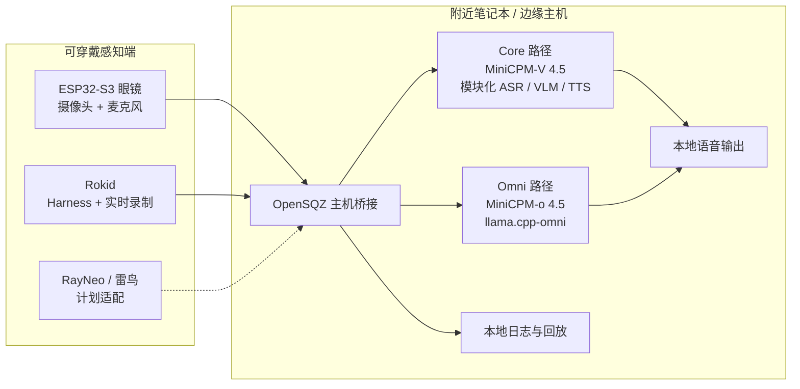

# OpenSQZ Glass

### 眼镜负责感知，近端设备负责本地智能

**一个面向本地优先视觉辅助的开源研究平台，将轻量的第一视角感知与附近笔记本或边缘主机上的多模态推理解耦。**

[English](README.md) · [安装与启动](#安装与启动) · [硬件教程](hardware/AI_GLASSES_OPEN_SOURCE_REPORT.md) · [ACL 2026 论文](https://aclanthology.org/2026.acl-demo.82/) · [安全与隐私](docs/safety_privacy.md) · [路线图](docs/roadmap.md)


*OpenSQZ Glass 3D 打印镜架与感知硬件。*

> 眼镜采集第一视角图像和声音，附近的电脑负责模型推理和语音生成。

## News

- **[2026.09.30]** 📢📢📢 我们将 **Harness 语音控制与 MiniCPM-o 对话链路集成**，并适配了 **Rokid 眼镜**，支持无线音视频传输、面板一键启动和本地录制。[开始使用](#安装与启动)。
- **[2026.08.04]** 📢📢📢 我们正式采用 **OpenSQZ Glass** 作为统一项目名称，汇集感知硬件、本地多模态运行时和相关研究方向。[查看项目概览](#项目概览)。
- **[2026.08.03]** 🥳🥳🥳 我们将实验性的 [OmniRuntime](runtime/openglass_omni/README.md) 合入统一仓库，包括控制面板、ESP32 桥接、Prompt 切换和本地 Session 录制/回放工具。[立即体验！](#安装与启动)
- **[2026.07.22]** 🔥🔥🔥 我们完整开源首版硬件材料，包括[可编辑 STEP 镜架](hardware/cad_3d_print/A02_frame_source.step)、[3MF 打印摆盘](hardware/cad_3d_print/A03_print_plate.3mf)、[物料清单（BOM）](hardware/bom/A01_bom_public.xlsx)、项目图片和[中英文制作教程](hardware/AI_GLASSES_OPEN_SOURCE_REPORT.md)。欢迎动手复现！
- **[2026.07.21]** ⭐️⭐️⭐️ OpenSQZ Glass 在 **WAIC 2026** 大会现场展出，并获 InfoQ 专题报道：[《OpenSQZ Glass：让端侧全双工全模态模型进入第一视角的可穿戴世界》](https://www.infoq.cn/article/UZ1j5LXmjNgiCfu5QL0s)。
- **[2026.07.20]** 🚀🚀🚀 我们的 3D 打印可穿戴硬件 Demo **OmniGlass-Edge** 被 [UbiComp/ISWC 2026](https://www.ubicomp.org/ubicomp-iswc-2026/) Posters & Demos 接收！欢迎查看[开源硬件教程](hardware/AI_GLASSES_OPEN_SOURCE_REPORT.md)。
- **[2026.07]** 📄📄📄 我们的 ACL 2026 System Demonstration 论文[《OpenGlass: A Sensing-Computing Split Architecture for Local MLLM-Driven Real-Time Visual Assistance》](https://aclanthology.org/2026.acl-demo.82/)已正式收录于 ACL Anthology。[阅读论文介绍](papers/acl2026.md)。
- **[2026.04.26]** 🎉🎉🎉 **OpenGlass 感知-计算分离系统**作为 OpenSQZ Glass 项目中的一个研究方向，被 [ACL 2026 System Demonstrations](https://aclanthology.org/2026.acl-demo.82/) 接收！
- **[2026.03.03]** 🔥🔥🔥 OpenGlass 仓库正式发布，首批开放 ESP32 感知固件和评测脚本。[立即体验！](#安装与启动)

## 项目概览

OpenSQZ Glass 提供眼镜端采集、电脑端多模态推理和语音交互组件，支持接入 ESP32 自制眼镜与 Rokid 眼镜。


*系统示意图，改编自 UbiComp/ISWC 论文 Figure 1。*

| 眼镜端 | 近端主机 | 本仓库提供 |
| --- | --- | --- |
| ESP32-S3 摄像头和 PDM 麦克风采集第一视角信息 | 笔记本或边缘主机在本地运行 ASR/VLM/TTS 或 MiniCPM-o | 固件、主机桥接、评测工具、实验运行时、会话回放和硬件文档 |

电脑端提供两种模型接入方式：MiniCPM-V 配合独立的 ASR/TTS，以及 MiniCPM-o 多模态对话。下文介绍 MiniCPM-o 面板的安装与使用；论文相关资料见“论文与引用”。


```mermaid
flowchart LR
  subgraph D["可穿戴感知端"]
    ESP["ESP32-S3 眼镜\n摄像头 + 麦克风"]
    ROKID["Rokid\nHarness + 实时录制"]
    RAYNEO["RayNeo / 雷鸟\n计划适配"]
  end

  ESP --> BRIDGE["OpenSQZ 主机桥接"]
  ROKID --> BRIDGE
  RAYNEO -.-> BRIDGE

  subgraph H["附近笔记本 / 边缘主机"]
    BRIDGE --> CORE["Core 路径\nMiniCPM-V 4.5\n模块化 ASR / VLM / TTS"]
    BRIDGE --> OMNI["Omni 路径\nMiniCPM-o 4.5\nllama.cpp-omni"]
    CORE --> OUT["本地语音输出"]
    OMNI --> OUT
    BRIDGE --> SESSION["本地日志与回放"]
  end
```

实线为已接入的设备，虚线为计划适配的设备。

## 安装与启动

完成首次环境和设备准备后，可通过面板一键启动。ESP32 与 Rokid 共用电脑上的推理后端，眼镜准备步骤分别进行，选择自己的设备分支即可。

### 1. 环境要求

以下以 Windows、Conda/Python 和 NVIDIA GPU 为例。编译后端需要 Visual Studio 2022 C++ Build Tools、CMake 及匹配的 CUDA 环境；Python 和依赖版本需与所用上游 checkout 一致。

- **ESP32 用户**：另需 Arduino IDE、ESP32 开发板支持和 USB 数据线。
- **Rokid 用户**：另需 Android Platform Tools（ADB）；首次编译采集 App 需要 Android SDK、JDK 17 和兼容的眼镜端工程。
- **功能对话**：需要本地 FunASR 模型，用于 Harness 语音控制。
- **MP4 录制**：需要 FFmpeg，并加入启动面板时的 PATH。

电脑与眼镜需要网络互通。模型权重、MiniCPM-o-Demo 和 llama.cpp-omni 均在本仓库之外准备。

### 2. 准备共用推理后端

将 OpenGlass、MiniCPM-o-Demo 和 llama.cpp-omni 分别放在独立目录中。面板通过本地配置找到各项目并启动服务。

V2 后端的启动顺序为：先启动独立的 `llama-omni-server`，再启动 `worker` 和 `gateway`。眼镜接入服务由 OpenGlass 面板另外启动。

```powershell
# 克隆 MiniCPM-o 所需的 llama.cpp-omni 后端
git clone --branch master https://github.com/tc-mb/llama.cpp-omni.git
# 进入目录并编译 CUDA 版本的推理服务
cd llama.cpp-omni
cmake -B build -DCMAKE_BUILD_TYPE=Release -DGGML_CUDA=ON -DLLAMA_CURL=OFF
cmake --build build --config Release --target llama-omni-server -j
cd ..

# 克隆 MiniCPM-o-Demo（包含 worker 和 gateway）
git clone --branch master https://github.com/OpenBMB/MiniCPM-o-Demo.git
cd MiniCPM-o-Demo
# 安装 MiniCPM-o-Demo 依赖
python -m pip install -r requirements.txt
cd ..

# 克隆 OpenGlass 项目
git clone https://github.com/OpenSQZ/OpenGlass.git
cd OpenGlass
# 安装 OpenGlass 运行时依赖
python -m pip install -r runtime/openglass_omni/requirements.txt
```

#### 模型文件

将 MiniCPM-o 4.5 GGUF 模块放在仓库之外的同一个目录中。当前启动器通过 `-m` 接收主模型路径；vision、audio、TTS 和 Token2Wav 文件应遵循当前 checkout 的 `llama.cpp-omni` 版本所要求的目录结构。

```text
MiniCPM-o-4_5-gguf/
├── MiniCPM-o-4_5-Q4_K_M.gguf
├── vision/
├── audio/
├── tts/
└── token2wav-gguf/
```

准确文件名和下载方法以 [`llama.cpp-omni` 的 prerequisites](https://github.com/tc-mb/llama.cpp-omni#prerequisites) 为准。

#### OpenGlass 功能依赖与 ASR

在运行 MiniCPM-o-Demo 的同一个 Conda 环境中，从 OpenGlass 仓库根安装面板及功能依赖：

```powershell
python -m pip install -r runtime/openglass_omni/requirements.txt
python -m pip install -r extensions/assistive_harness/phase_b/requirements-phase-b.txt
```

功能依赖文件同时包含 ESP32 图像筛选组件。下载配置示例中指定的 FunASR 模型，在后续配置中将模型目录填入 `asr_model`。

### 3. 准备眼镜（二选一）

#### ESP32：烧录固件并取得设备地址

1. 按[硬件教程](hardware/AI_GLASSES_OPEN_SOURCE_REPORT.md)准备眼镜。
2. 打开 [`CameraWebServer_PDM_Audio.ino`](CameraWebServer_PDM_Audio/CameraWebServer_PDM_Audio.ino)，在本机填写 Wi-Fi 名称和密码，选择匹配的 ESP32-S3 开发板并上传。
3. 用 `115200` 波特率打开串口监视器，记录设备连接 Wi-Fi 后取得的 IP；下一步将它填入设备表。

#### Rokid乐奇眼镜：安装采集 App 并准备 USB 调试

**手机端连接与开发者设置**

> 手机下载安装乐奇官方app Rokid AI，连接眼镜后在设置中开启开发者模式和眼镜 ADB 调试授权。

**编译与安装采集 App**

眼镜端源码位于 [`rokid_app/OpenGlassRokidSensor/`](rokid_app/README_zh.md)。安装 Android SDK 和 JDK 后，可使用提供的脚本编译；Gradle 依赖会在首次构建时下载。

采集 App **0.1.3 支持由面板在启动时传入电脑地址**。编译时无需填写 IP；安装后在 OpenGlass 本地配置中设置即可。

准备好 SDK 和 JDK 后，推荐在 OpenGlass 根使用构建安装脚本：

```powershell
# 连接 USB，先通过 adb devices -l 确认序列号
.\rokid_app\build_install.cmd -Sdk "<ANDROID_SDK_PATH>" -Install -Serial "<USB_SERIAL>"
```

省略 `-Install` 可只编译 APK。直接执行 Gradle/ADB 的等价步骤见 [Rokid App 说明](rokid_app/README_zh.md)。

安装后，允许采集 App 使用相机和麦克风，并通过设备或配套手机配置 Wi-Fi。安装报错的处理方法见下方“常见问题”。

首次启动时保持 USB 连接，待面板完成无线初始化后再拔线。

### 4. 配置 OpenGlass

以下命令均在 OpenGlass 仓库根执行。首次复制配置模板；已有本地配置时直接编辑，避免覆盖：

```powershell
Copy-Item runtime/openglass_omni/runtime.example.json runtime/openglass_omni/runtime.local.json
```

编辑 `runtime.local.json`，填写本机实际路径：

| 配置项 | 内容 |
| --- | --- |
| `minicpm_demo_root` | 包含 `worker.py`、`gateway.py` 的 MiniCPM-o-Demo 目录 |
| `llama_server` | 编译得到的 `llama-omni-server.exe` |
| `llama_model` | 主 GGUF 模型路径 |
| `asr_model` | Harness 使用的本地 FunASR 模型目录 |
| `conda_env` | 指定运行环境；留空则使用外部已激活的环境 |

面板启动时读取 `runtime.local.json`。修改配置后重开面板；首次使用沿用默认端口即可。

**ESP32 设备表**

```powershell
Copy-Item examples/configs/devices.example.json runtime/openglass_omni/devices.json
```

在设备表中填写名称、刚才取得的 `esp32_host`、HTTP 端口和摄像头顺时针旋转角 `rotate`（0、90、180 或 270）。

**Rokid 本地配置**

在完整 `runtime.local.json` 中补充或修改以下字段：

```json
{
  "rokid_mode": "wifi",
  "rokid_adb": "<ADB_EXE_ABSOLUTE_PATH>",
  "rokid_serial": "",
  "rokid_adb_addr": "",
  "rokid_pc_url": "http://<PC_LAN_IP>:18080"
}
```

通过电脑的 `ipconfig` 查找与眼镜网络互通的 IPv4，填入 `rokid_pc_url`。这是**电脑接收地址**；`rokid_adb_addr` 则是**眼镜无线调试地址**，首次由面板建立并保存。单副眼镜的 `rokid_serial` 可留空。

换网络后，先在眼镜端配置 Wi-Fi，再更新本地电脑地址并重开面板。面板会开启眼镜 Wi-Fi 并连接已保存的网络。

### 5. 启动与停止

激活准备好的 Conda 环境，在 OpenGlass 根目录运行：

```powershell
python glasses_panel.py
```

选择对应模式；ESP32 还需选择设备名称。点击“一键启动”，面板按顺序等待服务就绪：

```text
llama-omni-server :22500 → worker :22400 → gateway :8006
                                            ├─ ESP32 基础接入
                                            └─ Harness :8021 → ESP32 / Rokid 功能接入
第一视角页面 :8080；Rokid 采集输入 :18080
```

服务就绪后，打开第一视角页面，确认画面更新，再对眼镜说话测试回答。

**Rokid 首次无线初始化：** 保持 USB 接入，面板尝试开启 Wi-Fi、等待已保存网络取得地址，建立无线 ADB 并启动采集 App。日志确认无线 ADB 成功，且画面和声音正常后，才可拔 USB。如果日志提示“不能拔线”，保持 USB 连接并检查眼镜 Wi-Fi。

**可选：通过眼镜播放声音。** 将 Rokid 眼镜与电脑蓝牙配对，并在电脑声音设置中选择眼镜作为输出设备，再启动面板。这样无需通过电脑扬声器外放，有助于减少外放声音被眼镜麦克风再次收录。

之后关闭面板或重启电脑，可复用保存的无线地址。眼镜重启后若无法连接，按下方“常见问题”恢复无线调试。

结束使用时点“停止所有”，等待会话清理和录制导出完成，再关闭窗口。设备启动、安装错误与网络排查详见[完整启动指南](runtime/openglass_omni/STARTUP_zh.md)。

## 使用与配置

### 面板模式

| 模式 | 用途 |
| --- | --- |
| ESP32基础对话 | ESP32 音视频输入与模型对话，不经过 Harness 和选图漏斗。 |
| ESP32功能对话 | 加入 Harness 语音控制与图像质量筛选；质量拒绝不自动暂停对话、不播放提示语。 |
| Rokid功能对话 | Rokid 音视频输入与 Harness 语音控制；当前不启用 ESP32 选图漏斗。 |

Harness 支持“暂停”“继续”“重新开始”等语音控制，以及找物、读文字和描述场景等任务。触发说法和任务提示词均可修改。

### 修改关键词和提示词

**语音触发词**决定什么说法会触发控制或技能。复制示例后编辑本地文件，再重启 Harness：

```powershell
Copy-Item runtime/openglass_omni/voice_commands.example.yaml runtime/openglass_omni/voice_commands.local.yaml
```

**技能提示词**决定模型如何执行任务，位于 [`extensions/assistive_harness/prompts/`](extensions/assistive_harness/prompts/)，如 `find_object_zh.txt`、`read_text_zh.txt`。修改后重新激活技能或创建新会话；现有会话不会自动更新。

**面板普通聊天提示词**来自 `panel.py` 的 `CONFIG["presets"]`。Rokid 启动时传入的 `--prompt` 会优先于 `idle_chat_zh.txt`，因此只修改 idle 文件可能不生效。

### 录音、MP4 与回放

Rokid 启动命令使用 `--record-live` 开启录制，配合 `--ui-port 8080`，保存到 `live_sessions/rokid_<时间戳>/`。`--live-record-dir` 可指定其他父目录。

正常停止后先保存用户和模型的 WAV，再清理服务并合成 `live_session.mp4`。电脑 PATH 中需要有 FFmpeg；缺少 FFmpeg 时仍保留 WAV 和图片。MP4 左右声道分别保存用户输入与模型输出音频。

第一视角与回放页面分别为 `http://localhost:8080/`、`http://localhost:8080/replay`；回放页需在对应 UI 服务运行时访问。ESP32 的录制路径和命令行重放参见[运行时说明](runtime/openglass_omni/README.md)。

录音在停止时写入文件。录制结束后请使用页面停止按钮或面板“停止所有”，等待导出完成。

## 硬件资料

眼镜结构、打印文件与物料清单：

- [AI 智能眼镜开源报告（中文）](hardware/AI_GLASSES_OPEN_SOURCE_REPORT.md)
- [硬件发布概览](hardware/README.md)
- [可编辑 STEP 和 3MF 摆盘文件](hardware/cad_3d_print/README.md)
- [物料清单（BOM）](hardware/bom/README.md)
- [安全与隐私说明](docs/safety_privacy.md)

可编辑 STEP 用于修改镜架结构，3MF 文件用于打印摆盘；选型和采购可参考 BOM。

## 仓库结构

```text
OpenGlass/
├── glasses_panel.py                 # 面板入口
├── runtime/openglass_omni/          # 面板、设备启动、本地配置与操作指南
├── rokid_app/                      # Rokid 采集 App 源码、构建安装入口
├── extensions/assistive_harness/    # ASR、语音控制、技能提示词和设备运行时
├── CameraWebServer_PDM_Audio/       # ESP32 摄像头与 PDM 音频固件
├── eval_benchmark/                  # 研究评测与延迟脚本
├── hardware/                        # CAD、BOM 与组装说明
├── papers/                         # 论文资料
├── docs/                           # 架构、安全说明与路线图
└── examples/configs/               # 不含私人信息的配置示例
```

## 常见问题

### Rokid 安装 APK 时提示禁止安装或签名不一致

`not allow package install!`：检查手机 App 中的开发者模式、眼镜 ADB 调试及安装授权。

`INSTALL_FAILED_UPDATE_INCOMPATIBLE`：新旧 APK 签名不同。可以使用原签名重新构建；如果旧采集 App 的数据无需保留，也可卸载旧采集 App 后安装。卸载会清除该 App 的配置和权限，重新安装后需要再次允许相机和麦克风。

### Rokid 重启后无法无线连接

接回 USB，确认调试授权，再从面板启动。面板会开启 Wi-Fi、等待已保存网络连接并重新建立无线 ADB。无需重新安装采集 App。

### 服务已经启动，但没有画面或声音

Rokid 用户可打开 `http://127.0.0.1:18080/health`，查看 `image_count` 和 `audio_packets_in` 是否增长。若均为零，检查眼镜网络、`rokid_pc_url` 中的电脑地址，以及 Windows 防火墙是否放行当前 Python 的 TCP 18080 入站连接。

ESP32 用户检查 `devices.json` 中的 IP 是否与串口输出一致，确认设备与电脑网络互通。

### 停止录制后没有 MP4

先检查录制目录中是否有 `live_user.wav`、`live_ai.wav` 和图片。如果已有这些文件，在启动面板的终端执行 `ffmpeg -version`，确认 FFmpeg 可用，再查看录制日志中的合成报错。

如果连 WAV 也没有，检查是否通过停止按钮正常结束。音频在停止时保存，直接结束进程可能丢失尚未写入文件的录音。

### “重新开始”后推理后端退出

后端进程退出后，需要重启整条链路，单独重新连接眼镜无法恢复推理：

1. 点击“停止所有”，等待各服务停止。
2. 点击“一键启动”，等待 llama、worker、gateway 和设备接入服务重新就绪。
3. 确认第一视角更新，再发起新的对话。

## 论文与引用

ACL 2026 论文介绍了 OpenGlass 的感知与计算分离架构及其视觉辅助应用。

- **标题：** OpenGlass: A Sensing-Computing Split Architecture for Local MLLM-Driven Real-Time Visual Assistance
- **作者：** Mengzhang Li、Yuan Yao
- **会议：** ACL 2026 System Demonstrations，第 829-839 页

[[ACL Anthology](https://aclanthology.org/2026.acl-demo.82/)] [[PDF](https://aclanthology.org/2026.acl-demo.82.pdf)] [[DOI](https://doi.org/10.18653/v1/2026.acl-demo.82)]

```bibtex
@inproceedings{li2026openglass,
  title={OpenGlass: A Sensing-Computing Split Architecture for Local MLLM-Driven Real-Time Visual Assistance},
  author={Li, Mengzhang and Yao, Yuan},
  booktitle={Proceedings of the 64th Annual Meeting of the Association for Computational Linguistics (Volume 3: System Demonstrations)},
  pages={829--839},
  year={2026}
}
```

## License 与贡献

OpenSQZ Glass 采用 [Apache License 2.0](https://www.apache.org/licenses/LICENSE-2.0) 开源许可。

欢迎通过 [OpenSQZ/OpenGlass](https://github.com/OpenSQZ/OpenGlass) 提交 Issue 和 Pull Request。反馈运行问题时，请附上设备型号、运行环境、相关版本、复现步骤和问题发生时间，以及对应时段的 panel、设备接入（Rokid 或 ESP32）、Harness、gateway、worker 和 llama 日志中与问题相关的部分。分享前请移除凭据与个人信息。
