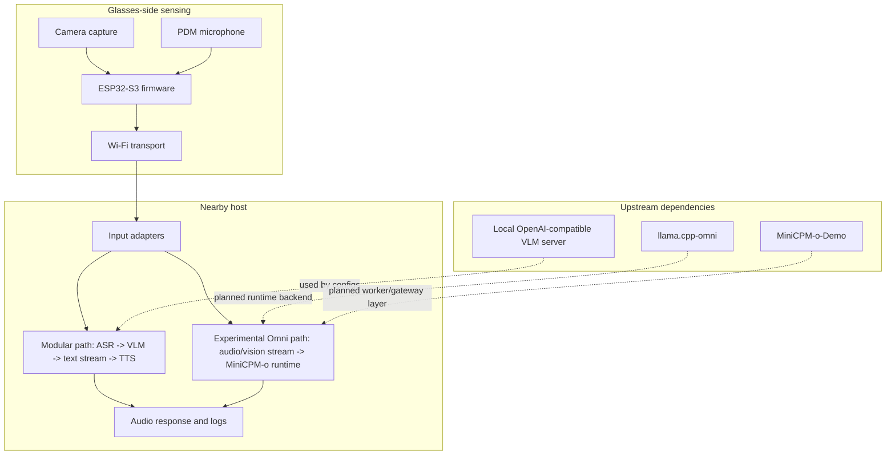

# Architecture

OpenGlass uses a sensing-computing split architecture. The glasses-side device captures camera frames and microphone audio, while a nearby laptop or edge host performs local inference, response handling, speech output, and evaluation.

## Verified in Current Tracked Code

- The ESP32 firmware initializes a camera and PDM microphone on an ESP32-S3 class board.
- The firmware exposes HTTP camera capture and preview behavior.
- The firmware exposes WebSocket PCM16 audio streaming at the public firmware endpoint documented in the source.
- The evaluation framework can run local OpenAI-compatible VLM calls, optional cloud baselines, stub mode, metrics, aggregation, and TTS timing experiments.
- `eval_benchmark/omni/` contains selected experiment harnesses for think-strategy, multiturn, and barge-in style evaluation.
- Generated evaluation outputs are intended to be written outside the source path or under ignored run directories.

## Experimental and Evidenced by Prototype Materials

- The Omni path conceptually uses four process roles: model server, worker, gateway, and OpenGlass bridge.
- MiniCPM-o 4.5 and `llama.cpp-omni` are upstream runtime dependencies.
- Worker and gateway ports are explicit local launcher configuration; values observed on one machine are not universal upstream defaults.
- ESP32 image input is expected to use an HTTP capture endpoint.
- ESP32 audio endpoint compatibility is pending verification; do not assume `/ws_audio` and `/ws_audio_v2` are interchangeable.
- Rokid input has prototype evidence, but public source, APK, permissions, and protocol details are not included in this Phase 1 release.
- Prompt switching, runtime text injection, multiturn behavior, and barge-in are research topics, not settled public runtime features.

## Implemented Experimental Adapter

- A standalone OpenGlass panel and process manager under `runtime/openglass_omni/`.
- A sanitized example device registry and local ignored configuration boundary.
- Explicit Start, Stop, Restart, Stop All, and Restart All behavior.
- External upstream checkout paths rather than copied MiniCPM-o-Demo or llama.cpp-omni source.

## Remaining Runtime Verification

- Clean-machine setup against recorded upstream commits.
- Verified ESP32 endpoint compatibility across firmware and runtime bridge code.
- Long-session, barge-in, session rerun UI, and skill-switching validation.
- Rokid source and APK publication review.

## Glasses-Side Sensing

The glasses-side unit is responsible for sensing and communication. It should be kept small, inspectable, and robust:

- Camera frames are captured by the ESP32-S3 firmware.
- PDM microphone samples are streamed over WebSocket.
- Wi-Fi transports sensor data to a nearby host.
- Large model inference does not run on the ESP32.

## Nearby-Host Inference

The nearby host owns compute-heavy processing:

- Optional ASR for spoken user input.
- Local VLM inference for image-conditioned responses.
- Streaming response handling.
- TTS or audio output.
- Timestamped evaluation and logging.

Generic loopback addresses such as `127.0.0.1` are appropriate when documenting a local service on the same host. Device addresses should use placeholders such as `<ESP32_IP>`.

## Privacy Boundary

Local inference reduces default exposure by keeping first-person images and audio on user-controlled devices unless optional cloud baselines are explicitly enabled. It is still not a formal privacy guarantee. Raw frames, audio, and logs can contain sensitive content and should be minimized, protected, and deleted when no longer needed.

## Upstream Dependency Boundary

OpenGlass links to upstream projects rather than vendoring large external codebases or model weights. The experimental adapter records locally observed commits for `llama.cpp-omni` and MiniCPM-o-Demo, but model conversion instructions, exact environment versions, and clean-machine validation are still required before it can be treated as reproducible.

## Launcher Lifecycle Boundary

The panel owns only processes that it starts. Restart and Stop affect the OpenGlass bridge only. Restart All and Stop All operate on the bridge, gateway, and worker; stopping the worker process tree also stops the llama-server child it launched. The panel refuses to take ownership of a port already held by an unrelated process. These semantics still require failure-injection and clean-machine testing.
