# AI Smart Glasses Open-Source Report

[Hardware Overview](README.md) | [ESP32 Firmware](../CameraWebServer_PDM_Audio/README.md)

**Table of Contents**

[Chapter 1 Project Overview](#chapter-1-project-overview)

[Chapter 2 Enclosure Design](#chapter-2-enclosure-design)

[Chapter 3 3D Printing Instructions](#chapter-3-3d-printing-instructions)

[Chapter 4 Internal Hardware Layout](#chapter-4-internal-hardware-layout)

[Chapter 5 Soldering Instructions](#chapter-5-soldering-instructions)

[Chapter 6 Assembly Instructions](#chapter-6-assembly-instructions)

[Chapter 7 Debugging and Testing](#chapter-7-debugging-and-testing)

[Chapter 8 Appendix](#chapter-8-appendix)

## Chapter 1 Project Overview

### 1.1 Description of Open-Source Content

This report makes public the soldering and assembly methods for the complete hardware system, including the installation positions, connection methods, and assembly procedures for components such as the development board, battery, camera, Type-C port, and power switch.

The content includes, but is not limited to:

- Descriptions of the installation positions of hardware components;
- Soldering methods for the battery, switch, Type-C module, and other components;
- Wire connections and routing methods;
- Internal space layout design;
- Complete-device assembly process;
- Precautions during assembly.

### 1.2 Hardware Components

This project adopts a modular hardware design. Its core components use off-the-shelf development boards and standard electronic components, eliminating the need to design a custom PCB and making hardware reproduction, maintenance, and future upgrades easier.

#### (1) XIAO ESP32-S3 Sense Development Board

The XIAO ESP32-S3 Sense serves as the main controller of the complete device and is responsible for camera data acquisition, wireless communication, and control of the functional modules. The development board is compact and supports camera expansion, Wi-Fi, Bluetooth, and other functions.

#### (2) OV5640-AF Camera

The OV5640-AF camera module is responsible for image acquisition. The project owner has confirmed that the module name is `OV5640-AF`. The autofocus function still needs near- and far-distance verification using the current firmware and physical hardware.

#### (3) 250 mAh Lithium-Polymer Battery

A single-cell 250 mAh lithium-polymer battery powers the complete device. While maintaining a lightweight design, it also provides device endurance sufficient for the daily operation of the smart glasses.

#### (4) Type-C Charging Port

The Type-C port is used to charge the lithium battery and also serves as the power port for the complete device, making routine charging, debugging, and maintenance convenient.

#### (5) Latching Power Switch

The latching power switch is connected in series with the power circuit to control power to the complete device, enabling power-on and power-off operation and reducing standby power consumption.

#### (6) Flexible Wire

The project uses SWAG flexible wire to complete the electrical connections between hardware components. The wire is soft, resistant to bending, and occupies little space, making it convenient for routing inside the temples. It can effectively reduce wire damage caused by repeated bending and is suitable for internal wiring in wearable devices.

### 1.3 Scope of This Open-Source Release

This open-source release mainly covers the mechanical structure, hardware soldering, and complete-device assembly of the smart glasses, including:

#### 3D Enclosure Structure

- Overall structure of the smart glasses;
- Frame and temple structure;
- Internal installation space;
- Installation structures for the hardware components;
- Enclosure assembly structure.

#### 3D Printing Instructions

- Recommended printing material;
- Printing parameters;
- Printing orientation;
- Support recommendations;
- Post-processing recommendations.

#### Hardware Soldering

- Connection relationships between hardware components;
- Battery soldering;
- Type-C charging module soldering;
- Latching switch soldering;
- Wire soldering;
- Soldering precautions.

#### Internal Hardware Layout

- Positions of the development board, camera, battery, Type-C port, and switch;
- Wire routing;
- Use of internal space.

#### Complete-Device Assembly

- Assembly process;
- Module installation order;
- Enclosure assembly method;
- Assembly precautions;
- Complete-device inspection method.

## Chapter 2 Enclosure Design

### 2.1 Overall Structure

This project adopts a modular structural design. The complete structure consists of a center frame, left temple, right temple, covers for the functional modules, cable ties, pins, and other parts. Each structure can be printed and assembled independently, making subsequent maintenance, replacement, and secondary development convenient. The overall structure is shown in Figure 2-1.

The center frame is mainly used to install the camera module and serves as the mounting foundation for the complete visual system. Camera installation space and a ribbon-cable channel are reserved inside the center frame to ensure that the camera remains stable after installation while preventing the ribbon cable from being squeezed or bent during assembly.

The left temple is mainly used to install the power modules. It integrates a 250 mAh lithium-polymer battery, a latching power switch, and a Type-C charging port. The internal space of the temple is planned according to the dimensions of each hardware component, and a wire-routing area is reserved to improve assembly convenience while maintaining a compact structure.

The right temple is mainly used to install the XIAO ESP32-S3 Sense development board. A development-board slot and fastening structure are provided inside the temple to position the board reliably. Space is also reserved for connecting the camera ribbon cable and power wires, making subsequent hardware connection and maintenance convenient.

For ease of installation and later maintenance, the center frame, left temple, and right temple all use independent cover structures. After assembly, the covers protect the internal hardware, prevent components from becoming loose during daily use, and improve the integrated appearance of the complete device.

Each cover is connected and secured to the main structure using cable ties. After the cable ties pass through the reserved mounting holes, they can fasten the covers reliably to the main structure. This method meets the fastening requirements of daily use while offering convenient disassembly and low maintenance cost. When the battery, development board, or other hardware needs to be replaced, maintenance can be completed simply by removing the cable ties without damaging the overall structure.

The temples are connected to the center frame with pins, allowing them to fold and unfold. After the pins are installed, the connection points remain stable while allowing the temples to open and close, improving the reliability and service life of the overall structure.

The entire structure fully considers the requirements of 3D printing and hardware assembly. While ensuring structural strength, it reasonably plans the installation space for each hardware component and the wire-routing areas. This gives the complete device a compact structure, simple assembly, convenient maintenance, and strong expandability, meeting the hardware-integration needs of AI smart glasses.

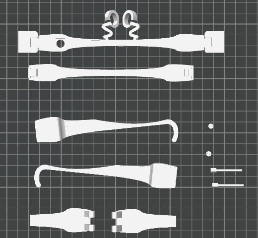

*Figure 2-1: Overall structural parts, pins, and small fasteners on the 3MF print plate.*

### 2.2 Frame and Frame-Cover Design

As the main structure of the complete device, the frame adopts a **one-piece U-shaped design**. It is mainly used to install the camera module and serves as the connection base for the left and right temples. The overall structure is lightweight while meeting mechanical-strength requirements, and it also considers 3D-printing manufacturability and wearing comfort.

An integrated nose-pad structure is designed in the middle of the frame to support contact between the glasses and the wearer's nose bridge and improve stability during wear. The nose pad uses a **"QZ"** letterform. **QZ** is the identifying mark of the **Shanghai Qi Zhi Institute Open-Source Platform (Open SQZ Glass)**. This incorporates the project identity while providing support, making the complete device more recognizable.

To meet visual-acquisition requirements, a mounting hole for the **DC5640-AF** camera is reserved on the front of the frame. The opening is designed according to the external dimensions of the camera module, allowing the lens to protrude accurately through the frame surface. This improves installation accuracy and overall appearance while ensuring that the camera field of view is unobstructed. Camera installation space and a ribbon-cable channel are also reserved inside the frame to facilitate camera fastening and cable routing.

Temple connection structures are provided on both sides of the frame, with pin mounting holes reserved for connection to the left and right temples so that the temples can fold and unfold. The connection structure fully considers the strength requirements of 3D-printed parts, improving the durability of the connection while maintaining assembly accuracy.

To protect the internal camera and ribbon cable while facilitating later maintenance, the frame uses a **separate main-body and cover design**. After the cover is fitted to the frame body, it effectively protects the internal components, prevents external forces from damaging the camera and ribbon cable, and gives the frame a more complete overall appearance.

The cover is aligned with the main structure through the reserved mounting holes and secured with cable ties. This fastening method does not require glue or permanent fasteners. It ensures cover stability after installation while making later disassembly and maintenance convenient. When the camera needs to be replaced or the internal wiring adjusted, the cover can be removed simply by cutting the cable ties, improving maintainability.

Taking structural strength, hardware installation, assembly efficiency, and later maintenance into account, the frame and cover both use modular designs. They meet the structural-integration requirements of AI smart glasses while facilitating future functional expansion and structural optimization.

### 2.3 Left and Right Temple Design

The left and right temples are important parts of the smart glasses. They not only support the complete device and enable it to be worn, but also serve as the main carriers for the internal hardware. This project assigns different functions to the two temples and plans their internal spaces according to the dimensions and functional requirements of different hardware modules. This improves internal-space utilization and assembly efficiency while maintaining structural strength.

The left temple is mainly used to install the power modules, including the 250 mAh lithium-polymer battery, latching power switch, and Type-C charging port. Corresponding installation cavities are designed inside the temple according to the shape and dimensions of each component, with wire-routing space reserved so that each component can be fastened securely without structural interference making assembly difficult. The Type-C port is positioned at the rear of the temple for convenient routine charging and device debugging, while the latching switch is installed in an accessible position to improve ease of use.

The right temple is mainly used to install the XIAO ESP32-S3 Sense development board. A dedicated mounting slot is designed according to the board dimensions so that the board can be positioned accurately and installed securely. Space is also reserved inside the temple for routing the camera ribbon cable, power wires, and other connecting wires. This reduces wire bending and stress, improves operating reliability, and facilitates later maintenance.

Both temples use separate main-body and cover structures. The temple bodies carry the internal hardware, while the covers close the installation cavities, protect the internal components and wires, and improve the integrated appearance. The split design allows the internal hardware to be installed, inspected, and replaced without damaging the main structure, improving maintainability.

The covers are connected to the temple bodies using cable ties. Both the temple bodies and covers have reserved cable-tie mounting holes. During assembly, the cable ties pass through the corresponding holes to complete fastening. This method requires no glue or screws, is simple to install and reliable, and allows the covers to be removed quickly for battery replacement, development-board replacement, or wiring repair.

A pin connection structure is provided at the front of each temple. The pins connect the temples to the frame, allowing them to fold and unfold. The pin connection is structurally simple and easy to install. It provides good durability while maintaining connection strength and can meet the repeated opening and closing requirements of daily smart-glasses use.

Taking the internal hardware layout, assembly process, and wearing comfort into account, the left and right temples use modular designs with mutually independent functional modules. This keeps the complete device compact while facilitating future hardware upgrades and structural optimization, providing a solid structural foundation for assembling and maintaining the AI smart glasses.

### 2.4 Internal Space Planning

The internal space must account for hardware dimensions, weight, connection relationships, ribbon-cable bend radius, and later maintenance. In the current layout, the camera is placed in the center frame, the development board in the right temple, and the battery and power modules in the left temple.

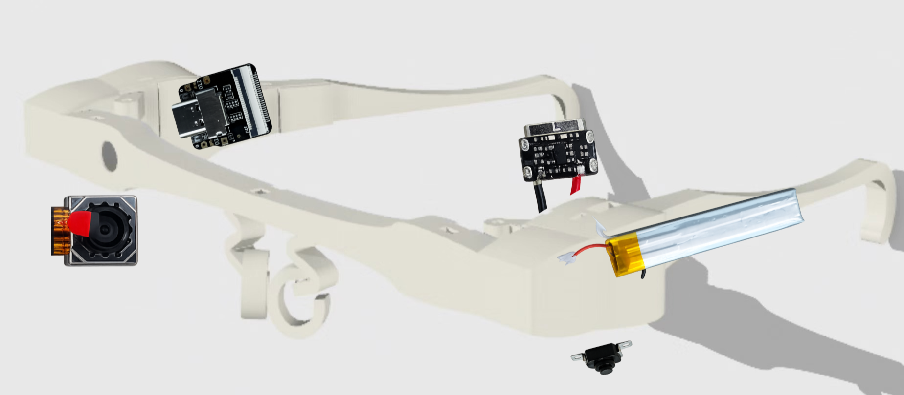

*Figure 2-2: Positioning of the camera, XIAO ESP32-S3 Sense, battery, Type-C charging module, and latching switch.*

### 2.5 Module Installation Positions

To make full use of the limited internal space of the smart glasses, this project uses a modular layout. The camera, development board, battery, Type-C charging port, and latching power switch are planned according to the dimensions, weight, and functional characteristics of each hardware module. This keeps the complete structure compact while improving assembly efficiency and the convenience of later maintenance. The module installation positions are shown in Figure 2-4.

The **DC5640-AF camera** is installed at the front-center of the frame body. A correspondingly sized mounting hole is reserved on the front of the frame so that the camera lens protrudes through the frame surface and acquires images from a viewpoint close to the human eye. A camera cavity and ribbon-cable channel are also reserved inside the frame to facilitate camera fastening and cable connection and to prevent the ribbon cable from being squeezed or bent during assembly.

The **XIAO ESP32-S3 Sense development board** is installed inside the right temple. A dedicated mounting slot is designed according to the external dimensions of the development board, allowing it to be positioned accurately and installed securely. The board interface faces the frame, making it convenient to connect the camera ribbon cable and power wires. Installation and maintenance space is also reserved for later firmware flashing, debugging, and board replacement.

The **250 mAh lithium-polymer battery** is installed inside the left temple. Because the battery is relatively long, a cavity matching its dimensions is designed inside the temple so that it can be placed securely while making full use of the internal space. This layout improves space utilization and makes the left-right weight distribution of the complete device more reasonable, improving comfort during wear.

The **Type-C charging port** is installed at the front of the left temple, with a corresponding opening reserved in the enclosure so that the charging port is directly exposed for convenient device charging and firmware debugging. This position also shortens the connection distance between the charging module and battery, simplifying internal wiring.

The **latching power switch** is installed in the reserved mounting hole on the underside of the left temple, allowing the user to turn the device on and off quickly while putting on or removing the glasses. The installation position considers operating convenience and overall appearance and does not affect the wearing experience during normal use.

The modules are connected using **SWAG flexible wire**, routed along the reserved channels inside the frame and temples. The camera ribbon cable connects the frame to the development board in the right temple, while the power wires connect the left temple to the development board in the right temple. All wires are routed along structural edges to avoid crossing, stacking, and excessive bending as much as possible. This reduces assembly difficulty, improves operating reliability, and facilitates later maintenance and hardware replacement.

Considering the dimensions, connection relationships, and spatial layout of the hardware modules, this project places the camera in the frame, the development board in the right temple, and the battery and power modules in the left temple. This arrangement distributes the functional modules rationally, improves internal-space utilization, reduces wire crossings, and considers structural stability, wearing comfort, and the convenience of later maintenance.

## Chapter 3 3D Printing Instructions

### 3.1 Printing Material Selection

This project recommends **eSUN PETG-LW (Lightweight PETG), which was used in this experiment**, as the printing material for the smart-glasses enclosure. PETG-LW combines the good toughness and lightweight characteristics of PETG. It can effectively reduce the total weight and improve wearing comfort while maintaining structural strength, making it suitable for wearable devices intended for extended wear.

Compared with ordinary PLA, PETG-LW offers better impact resistance and fatigue resistance and is less likely to break when the temples are opened and closed repeatedly. Compared with ordinary PETG, its foaming characteristics reduce material density, making the printed device lighter and better suited to the lightweight design requirements of smart glasses.

Before printing, it is recommended to dry the filament thoroughly in a drying device to reduce stringing, bubbles, surface roughness, and other problems caused by moisture during printing, thereby improving print quality. Your print records also show that printing stability and surface quality improved significantly after the filament was dried.

**Recommended filament:**
- Brand: eSUN
- Model: PETG-LW
- Color: White (recommended)
- Diameter: 1.75 mm
- Drying before printing: 55 C x 6 h

### 3.2 Printing Orientation

All structures in this project are arranged according to the principle of reducing support marks on visible surfaces. Priority is given to the print quality of the outward-facing surfaces of the glasses, and support structures are placed on internal mounting surfaces or other non-visible areas whenever possible to reduce post-processing work. The print-plate file is provided at the end of this document.

The main frame is printed with the nose pads facing upward so that the camera mounting area and the exterior surface of the frame achieve good print accuracy. The left and right temple bodies are printed on their sides so that the outer temple surfaces form continuously, reducing layer lines and support-contact areas. The covers are printed flat to achieve good surface flatness and dimensional accuracy.

The actual printing orientation should follow the arranged models provided in the slicing software, and all model orientations should remain consistent to ensure consistent assembly dimensions.

### 3.3 Recommended Printing Parameters

Based on the results of multiple printing tests, this project recommends the following printing parameters to balance print quality, structural strength, and printing efficiency.

| Parameter | Value Recommended in the Source Report |
| --- | --- |
| Printer | Bambu Lab A1/A1L/X2D (original wording, **NEEDS VERIFICATION**) |
| Nozzle diameter | 0.4 mm |
| Nozzle type | Stainless-steel nozzle |
| Layer height | 0.16 mm (recommended) |
| First-layer height | 0.20 mm |
| Wall count | 3 Walls |
| Top layers | 5 layers |
| Bottom layers | 5 layers |
| Infill density | 15% |
| Infill pattern | Gyroid |
| Outer-wall speed | 80 mm/s |
| Inner-wall speed | 150 mm/s |
| Infill speed | 180 mm/s |
| Printing temperature | 250 C |
| Bed temperature | 70 C |
| Fan | 30%-50% |
| Seam position | Back |
| Z-Hop | Auto |

### 3.4 Support Settings

This project recommends Tree Support as the primary support method. Compared with conventional supports, tree supports effectively reduce material consumption and the contact area between the supports and the model, helping reduce marks left after support removal.

Supports are generated only from the build plate. Support structures should be avoided on visible exterior surfaces of the glasses whenever possible and concentrated on the inner sides of the temples, installation cavities, and other non-visible areas.

Support regions must be painted manually on this model.

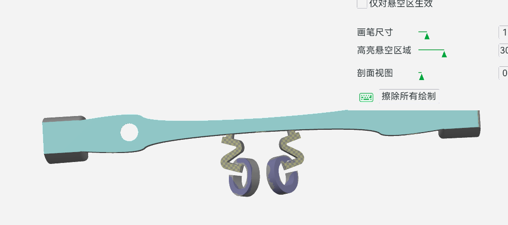

*Screenshot showing the manually painted highlighted support regions in the slicing software.*

**Recommended parameters**
- Support type: Tree Support
- Support generation: From Build Plate Only
- Support interface: Enabled
- Support spacing (Z Distance): 0.20 mm
- Brim: Enabled (5 mm)

### 3.5 Post-Processing

After printing is complete and the parts have cooled, remove all support structures and the brim. Check for remaining supports, stringing, and burrs. A model-trimming knife, small pliers, or sandpaper can be used for finishing.

Before installing electronic components, check that the camera cavity, FPC channel, Type-C opening, switch opening, cable-tie holes, and pin holes are unobstructed, and complete a dry-fit test first.

### 3.6 Common Printing Problems and Solutions

| Problem | Cause | Solution |
| --- | --- | --- |
| Stringing | Moist filament | Thoroughly dry the filament before printing |
| Spaghetti failure/surface abnormality | Model detachment or filament tangling | Clean the print bed and inspect the filament path |
| Temple breakage | Insufficient walls or unreasonable orientation | Increase to 3 Walls and optimize the orientation |
| Rough support surface | Excessive support-contact area | Use tree supports and reduce support density |
| Type-C opening too tight | Print shrinkage | Reserve 0.2-0.3 mm clearance in the opening |
| Difficult camera installation | Insufficient dimensional tolerance | Clean the opening and edge burrs before installation |
| Obvious layer lines | Excessive layer height | Use 0.16 mm or a lower layer height |
| Rough appearance | Excessive outer-wall speed | Reduce the outer-wall speed to improve surface quality |

## Chapter 4 Internal Hardware Layout

### 4.1 Hardware Components

This project adopts a modular hardware design. All functional modules use off-the-shelf development boards and standard electronic components, allowing the complete device to be built without designing a custom PCB. The hardware modules are arranged according to their dimensions, weight, and connection relationships, enabling reasonable integration within the limited space of the complete device while also considering assembly convenience, wearing comfort, and later maintenance requirements.

The complete device mainly consists of a XIAO ESP32-S3 Sense development board, a DC5640-AF autofocus camera, a 250 mAh lithium-polymer battery, a Type-C charging port, a latching power switch, and SWAG flexible wire. The modules are connected by wires, secured using mounting structures reserved inside the frame and temples, and enclosed and protected with covers.

### 4.2 Development Board Installation Position

The XIAO ESP32-S3 Sense development board is installed inside the right temple and positioned and secured using a dedicated mounting slot. The board interface faces the frame to facilitate connection of the camera ribbon cable and power wires, while reducing wire length and improving overall routing efficiency.

The internal structure of the right temple is optimized according to the development-board dimensions. While ensuring secure installation, it reserves maintenance space for later firmware flashing, debugging, and development-board replacement. After installation, the temple cover encloses and protects the board from external impact and dust.

### 4.3 Camera Installation Position

The DC5640-AF autofocus camera is installed at the front-center of the frame body and secured in a reserved internal cavity. A mounting hole matching the camera-lens dimensions is provided on the front of the frame so that the lens protrudes through the frame surface and acquires images from a viewpoint close to the human eye.

The camera ribbon cable is routed through the reserved channel inside the frame and connected to the development board in the right temple. This layout ensures stable camera installation, prevents the ribbon cable from being squeezed or excessively bent, and improves operating reliability.

### 4.4 Battery Installation Position

The 250 mAh lithium-polymer battery is installed inside the left temple in a dedicated cavity designed according to the battery dimensions. The battery is arranged lengthwise along the temple, making full use of the internal space while ensuring installation stability.

The battery is positioned close to the charging module, effectively shortening the power-wire length and reducing the complexity of internal wiring. Placing the battery and development board in the left and right temples respectively also helps balance the total weight and improve wearing comfort.

### 4.5 Type-C Port Installation

The Type-C charging port is installed at the front of the left temple. A corresponding opening is reserved in the enclosure so that the charging port is exposed directly for convenient device charging.

The mounting structure uses a positioning slot designed according to the dimensions of the Type-C module. After installation, the port remains stable and does not move noticeably when the charging cable is inserted or removed, improving port life and overall reliability.

### 4.6 Power Switch Installation

The latching power switch is installed in the reserved mounting hole on the underside of the left temple. After installation, the switch button protrudes through the enclosure surface, allowing the user to turn the device on and off directly.

The installation position fully considers convenience in daily use and the overall appearance. It does not interfere with normal wear and effectively avoids accidental activation, improving device safety.

### 4.7 Wire-Routing Plan

This project uses SWAG flexible wire to complete the electrical connections between the modules. Based on the structural characteristics of the complete device, all wires are routed along the reserved channels inside the frame and temples to prevent suspended or crossing wires and improve internal-space utilization.

The camera ribbon cable connects the frame to the development board in the right temple. The battery, latching power switch, and Type-C charging port are connected by wires to the power input of the development board. Wire bend radius and moving space are fully considered during routing to prevent long-term squeezing, stretching, or bending and improve long-term reliability.

### 4.8 Use of Internal Space

This project plans the internal spaces of the frame and left and right temples according to the dimensions and functional characteristics of the hardware modules. The frame is mainly used to install the camera, the right temple mainly holds the development board, and the left temple mainly holds the battery, Type-C charging port, and latching power switch. This keeps the functional modules independent and prevents mutual interference.

All modules use a modular layout. While maintaining a compact structure, the design reserves the necessary assembly and maintenance space, keeps internal wiring tidier, reduces assembly difficulty, and makes later repair, replacement, and upgrades more convenient. The module weights are also distributed relatively evenly, helping improve the stability and comfort of the smart glasses during wear.

## Chapter 5 Soldering Instructions

### 5.1 Preparing Soldering Tools

Before hardware soldering, prepare the required tools and materials in advance and ensure that the work environment is clean and well ventilated. An antistatic workbench is recommended during soldering to prevent electrostatic damage to the development board and electronic components.

  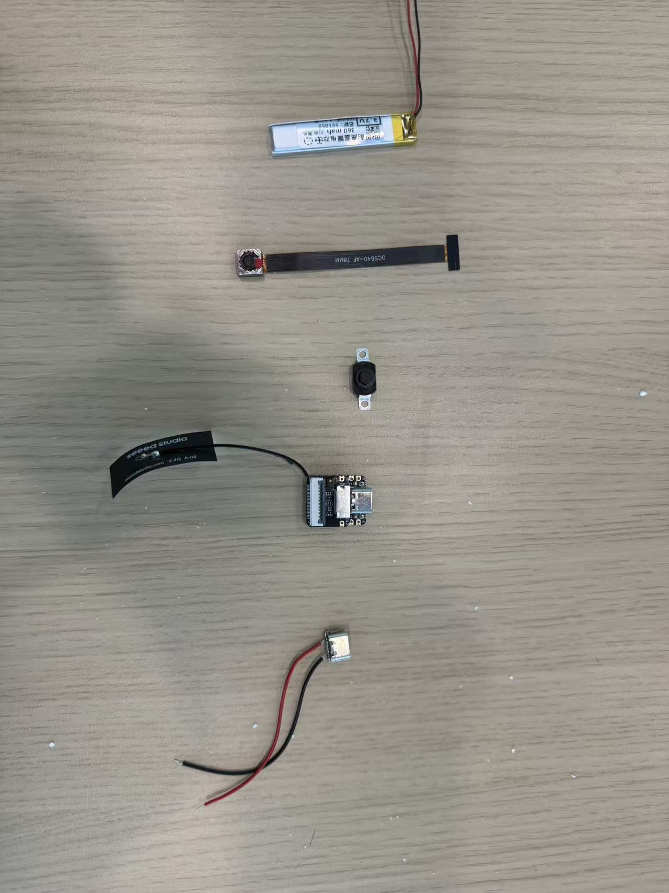

The soldering tools recommended for this project are listed below:

| Tool | Recommended Specification | Purpose |
| --- | --- | --- |
| Temperature-controlled soldering iron | 320-350 C | Soldering components |
| Solder wire | 0.6-0.8 mm | Soldering wires and pads |
| Tweezers | Antistatic | Holding small components |
| Wire stripper | Match the wire gauge | Wire preparation |
| Diagonal cutters | Small | Trimming wires and cable ties |
| Multimeter | Digital multimeter | Continuity and short-circuit testing |
| High-temperature tape | Kapton tape | Temporarily securing ribbon cables |

### 5.2 Wire Specifications

This project uses SWAG flexible wire as the primary connection wire. SWAG wire is soft, resistant to bending, and occupies little space, making it suitable for smart glasses and other wearable devices with limited internal space.

Based on the structural dimensions of the complete device, this project consistently uses wires approximately **150 mm** long to connect the development board, battery, and power modules. This length meets the routing requirements inside the frame and temples while reserving an appropriate margin to prevent tension caused by wires that are too short during assembly.

After soldering, exposed solder joints should be insulated with heat-shrink tubing or electrical tape to prevent short circuits between wires.

### 5.3 Battery Soldering

As the power module for the complete device, the battery should first be connected to the Type-C charging module. During soldering, the battery's positive and negative terminals must be connected to the corresponding BAT+ and BAT- pads on the charging module. They must not be reversed, as doing so may damage the battery or development board.

Next, solder an approximately 150 mm SWAG wire to the negative battery terminal to serve as the BAT- input wire for the development board. After soldering, immediately inspect the solder-joint quality and cover exposed joints with insulating material to prevent short circuits.

  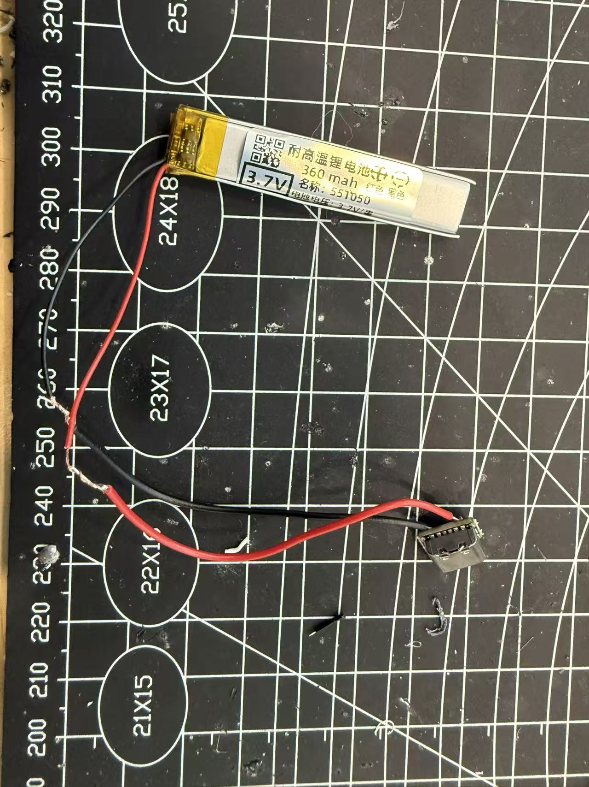

### 5.4 Switch Soldering

The latching power switch is connected in series with the battery's positive power circuit to control power to the complete device. During soldering, first connect the battery's positive terminal to the switch input, then solder an approximately 150 mm SWAG wire to the switch output as the BAT+ input wire for the development board.

During soldering, ensure that the wires are firmly connected to the switch terminals and avoid cold joints or loose solder joints. An appropriate wire length should also be reserved for subsequent installation inside the left temple.

  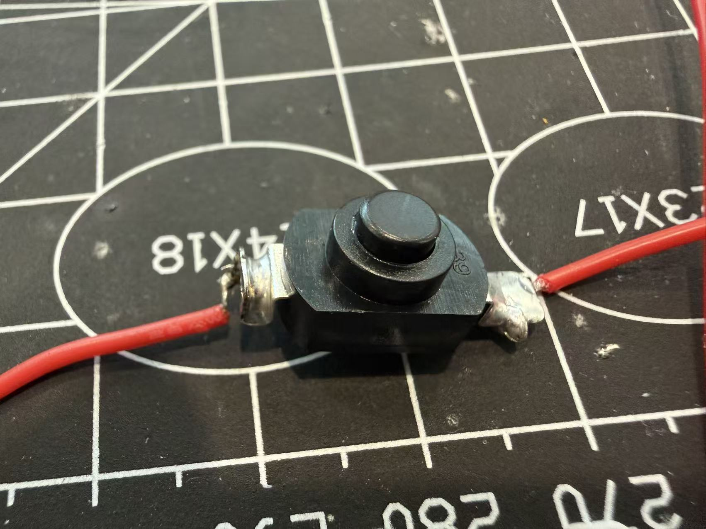

### 5.5 Development Board Soldering

The development-board charging module is first soldered to the lithium battery to complete the battery power-management circuit. During soldering, confirm that the BAT+ and BAT- pads correspond correctly and ensure that the solder joints are full and secure.

After soldering, check whether the Type-C port aligns with the reserved opening in the left temple. Ensure that after installation the charging port is exposed correctly through the enclosure and that a charging cable can be inserted smoothly.

<table align="center">
  <tr>
    <td align="center">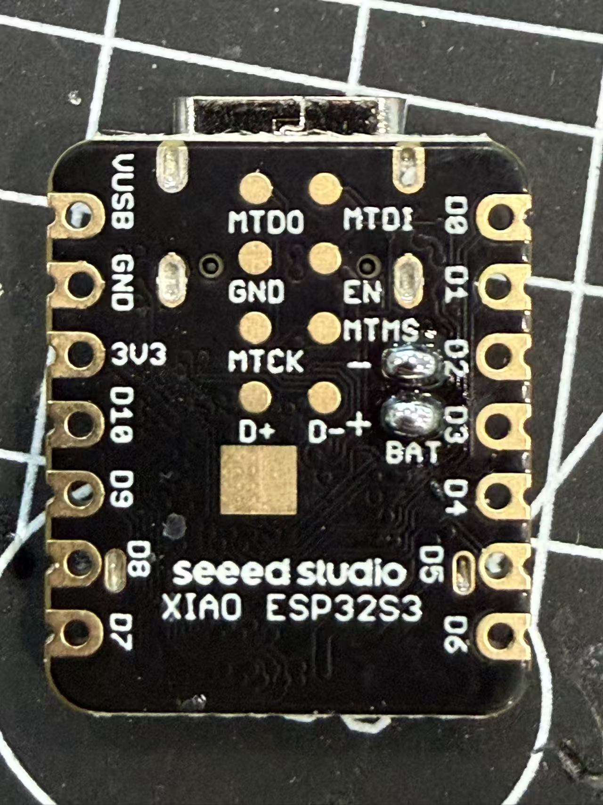</td>
    <td align="center">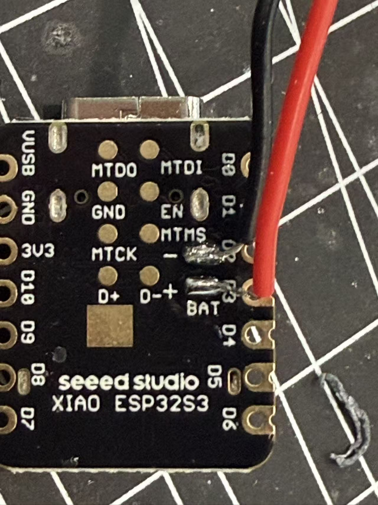</td>
  </tr>
  <tr>
    <td align="center"><em>Before soldering</em></td>
    <td align="center"><em>After soldering</em></td>
  </tr>
</table>

### 5.6 Solder-Joint Inspection Criteria

After all soldering is complete, inspect each solder joint and use a multimeter to test continuity and short circuits. The solder joints should meet the following requirements:

- Solder-joint surfaces are smooth and form uniform hemispheres;
- Solder fully covers the pads and wires;
- No cold or missing solder joints;
- No solder bridges or bridging short circuits;
- Wires are secured firmly and cannot detach easily;
- No short circuit exists between BAT+ and BAT-;
- The Type-C charging-module output is normal;
- The switch controls power normally.

Only after confirming that all the above requirements are met should complete-device assembly proceed.

### 5.7 Soldering Precautions

Avoid holding the soldering iron against a pad for a long time, as this may lift the pad or damage components. After soldering, promptly clean any soldering residue and keep the joints tidy.

The camera FPC ribbon cable must not be inserted in reverse or bent excessively. During installation, confirm that the ribbon cable is fully inserted into the connector and lock the ribbon-cable latch to prevent the camera from failing because of poor contact.

After battery soldering, immediately insulate exposed solder joints to prevent short circuits caused by contact with metal. Wire length can be adjusted appropriately according to the actual assembly, but a suitable margin should be retained to prevent the wires from being stretched during assembly.

Before completing assembly, it is recommended to use a multimeter again to check whether a short circuit exists between BAT+ and BAT-. Confirm that the Type-C charging module output voltage is normal before connecting the development board for the first power-on test, ensuring safe and reliable operation of the complete device.

## Chapter 6 Assembly Instructions

### 6.1 Preparation Before Assembly

Before assembling the complete device, confirm that all 3D-printed parts, electronic components, and soldered assemblies are ready, and inspect each part for damage or dimensional abnormalities. Before assembly, remove support residue and burrs from the printed parts to ensure that all mounting positions are flat and do not affect subsequent assembly accuracy.

Also confirm that the development board, battery, camera, Type-C charging module, latching power switch, and SWAG wires have all been soldered and have passed continuity and short-circuit tests. Before the first assembly, it is recommended to test each module independently and proceed with complete-device assembly only after confirming that all hardware operates normally.

  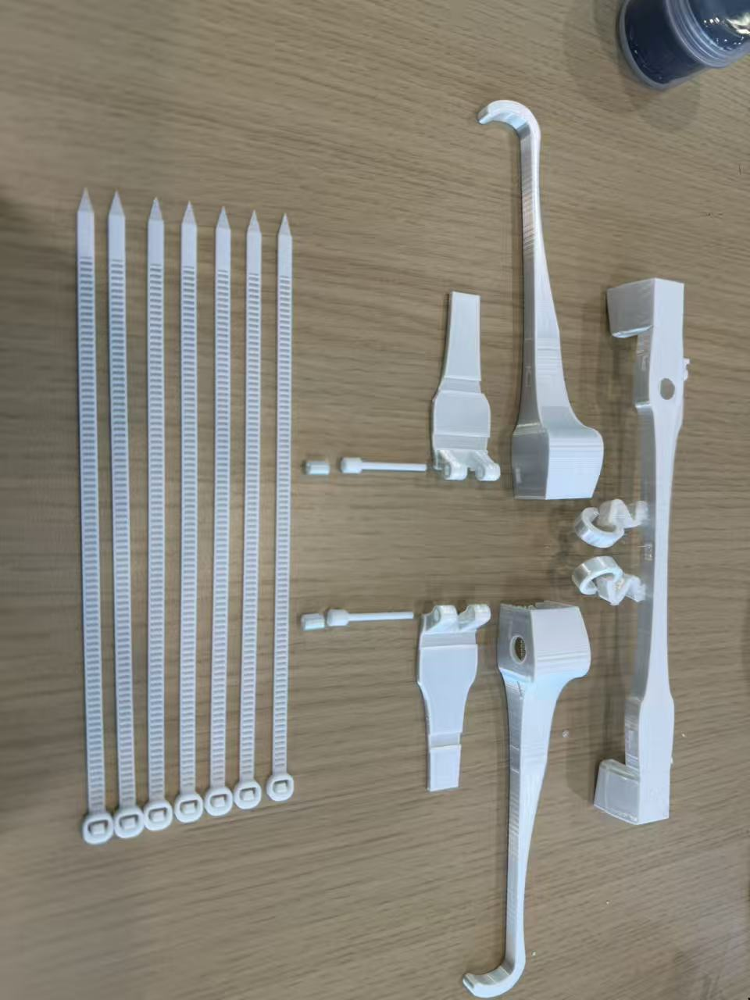

### 6.2 Assembly Order

To improve assembly efficiency and reduce wire crossings, this project follows the principle of assembling from the inside outward and from functional modules to the overall structure. The recommended assembly order is:

(1) Install the camera module;

(2) Install the left-temple power modules;

(3) Install the right-temple development board;

(4) Organize the internal wires;

(5) Install the structural covers;

(6) Connect the left and right temples to the frame;

(7) Complete the final device inspection.

Following the above order can effectively prevent interference between modules and improve assembly efficiency and overall reliability.

### 6.3 Camera Installation

Place the DC5640-AF camera into the reserved cavity inside the frame body, and align the camera lens accurately with the mounting hole on the front of the frame. Ensure that the lens is fully exposed and unobstructed.

Next, route the camera FPC ribbon cable along the reserved internal channel in the frame and connect it to the XIAO ESP32-S3 Sense development board. During installation, confirm that the ribbon cable is fully inserted into the connector and lock the FPC latch to prevent the camera from failing because of poor contact. After securing the camera, check that the lens is centered and confirm that the ribbon cable is not squeezed or excessively bent.

  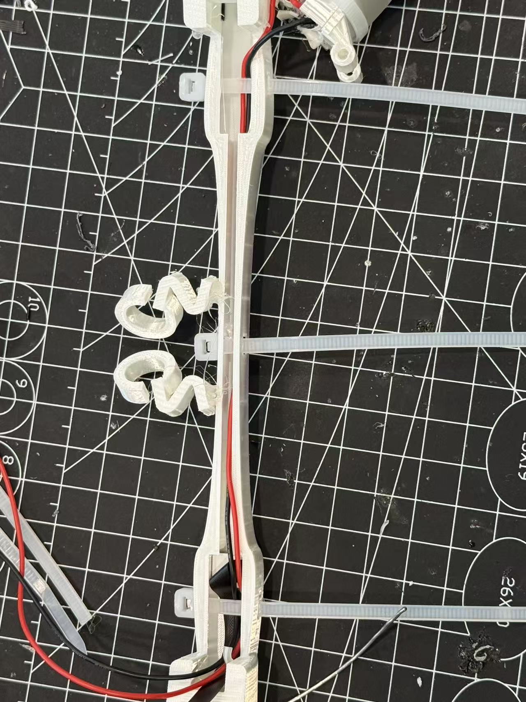

### 6.4 Development Board Installation

Place the XIAO ESP32-S3 Sense development board into the mounting slot inside the right temple and adjust its position so that each interface connects smoothly to the internal wires. The antenna and camera module must be installed strictly on the development board.

During installation, ensure that the bottom of the development board does not press against the wires or Wi-Fi antenna. Keep the camera ribbon cable naturally curved without folding or stretching it. After confirming that the development board is positioned correctly, organize the surrounding wires in preparation for installing the cover.

  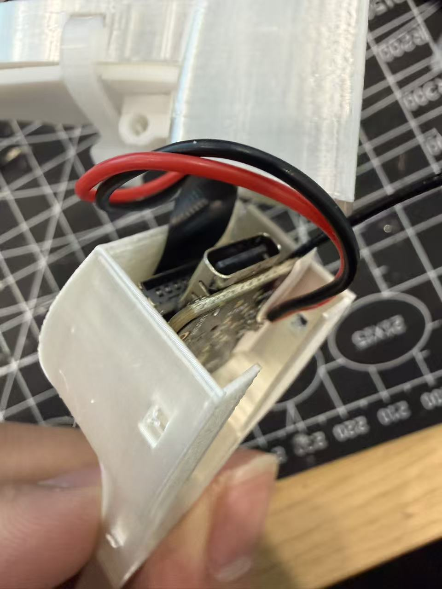

### 6.5 Battery Installation

Place the soldered 250 mAh lithium-polymer battery, Type-C charging module, and latching power switch into their corresponding installation positions inside the left temple in sequence.

During installation, first adjust the Type-C charging port so that it aligns accurately with the reserved opening in the enclosure. Next, adjust the latching power switch so that its button protrudes normally through the enclosure. Finally, place the battery in the installation cavity inside the temple and organize the power wires, ensuring that the components are stable and do not interfere with one another.

<table align="center">
  <tr>
    <td align="center">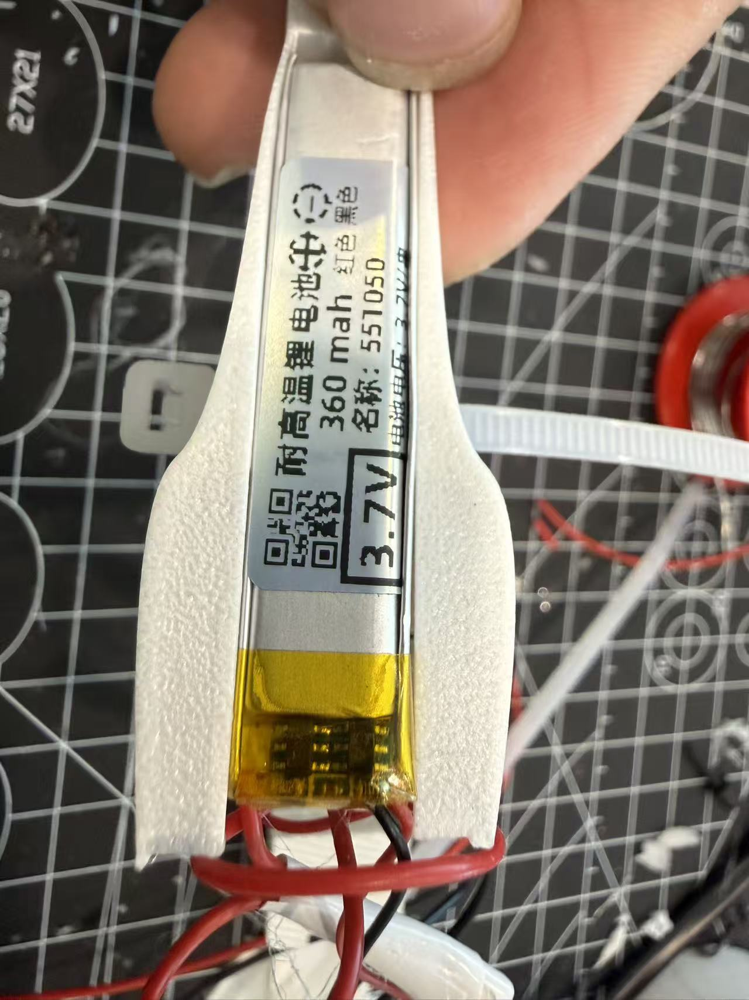</td>
    <td align="center">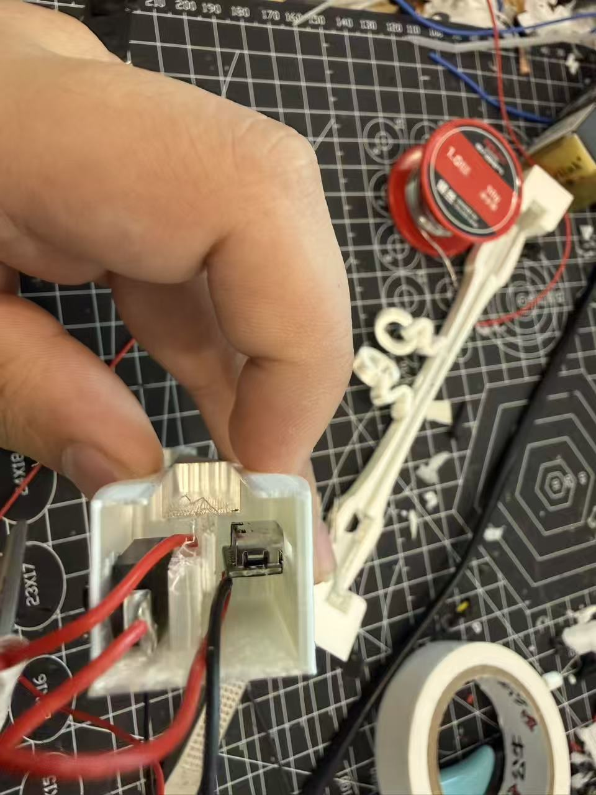</td>
  </tr>
  <tr>
    <td align="center"><em>Before soldering</em></td>
    <td align="center"><em>After soldering</em></td>
  </tr>
</table>

### 6.6 Wire Organization

After all modules have been installed, organize the internal wires together. Route the camera ribbon cable through the frame to the right temple. The power wires connect the modules inside the left and right temples and are secured along the reserved routing channels.

During organization, avoid crossing, tangling, or stacking the wires. Ensure that they maintain an appropriate bend radius without excessive stretching or squeezing. Also confirm that the wires do not obstruct the cover mounting positions or interfere with the opening and closing of the temples.

### 6.7 Closing the Enclosure

After confirming that all internal modules have been installed and the wires organized, install the frame cover, left-temple cover, and right-temple cover on their corresponding main structures.

After installing the covers, pass cable ties through the reserved mounting holes and secure the covers to the main structures. The cable ties should have appropriate tension to ensure secure cover installation while preventing excessive tightness from squeezing the development board, battery, ribbon cable, or wires.

Finally, connect the left and right temples to the frame using the pins and check that the temples open and close smoothly, ensuring that the complete structure is fully installed.

  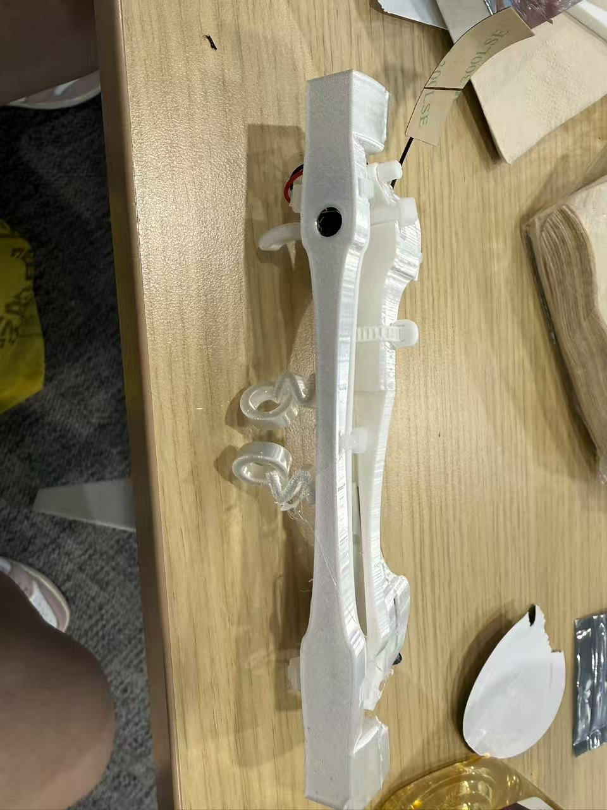

### 6.8 Final Inspection

After complete-device assembly, thoroughly inspect the appearance, structure, and hardware functions to ensure that the device operates normally.

The main inspection items are:
- The enclosure is installed securely with no obvious gaps;
- The left and right temples open and close normally without binding;
- The camera lens is positioned correctly and unobstructed;
- The Type-C charging port is positioned accurately and accepts a charging cable normally;
- The latching power switch operates normally;
- The wires are organized neatly, without squeezing or exposed conductors;
- The development board is secured firmly without looseness;
- The battery is installed stably without obvious movement;
- The cable ties are reliable and present no risk of detachment;
- After the first power-on, the development board starts normally, the camera is recognized normally, and charging functions normally.

After completing the above checks and confirming that there are no abnormalities, assembly of the AI smart glasses is complete and the device can proceed to subsequent functional testing and actual use.

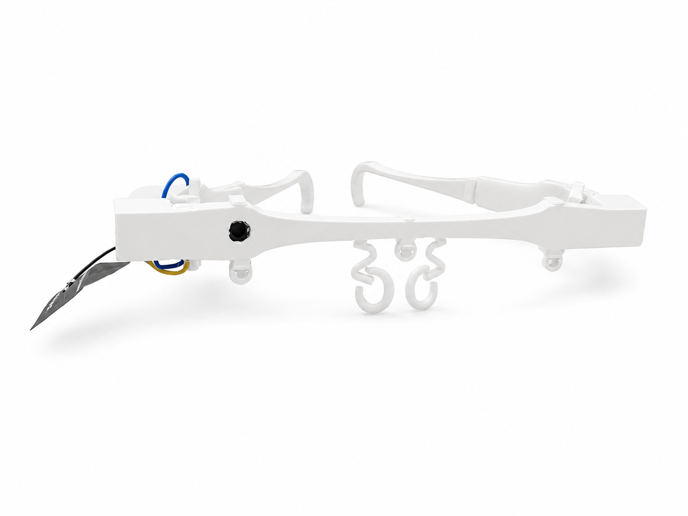

*Complete device*

## Chapter 7 Debugging and Testing

### 7.1 Power-On Check

After completing assembly of the device, first perform a power-on check to confirm that the power-supply system is connected correctly and that all modules can start normally. Also confirm that the Type-C charging module output voltage is normal.

After switching on power, observe whether the development board's power indicator lights normally and confirm that the board starts normally. If it does not start, disconnect power immediately and check the battery polarity, BAT+ and BAT- soldering positions, latching-switch connection, and wires for cold joints or short circuits.

After completing the power-on check, confirm that the development board operates stably (normally, a yellow light will illuminate) and that there is no abnormal heating, odor, smoke, or other abnormal condition, ensuring that the complete power-supply system operates normally.

### 7.2 Camera Check

After the development board starts, check whether it recognizes the OV5640-AF. After flashing the firmware, read the DHCP-assigned `<ESP32_IP>` from the serial port, then test the image in a browser.

Check whether the image is clear, the colors are normal, and the lens is unobstructed. Autofocus must be tested separately. If the screen is black, the colors are abnormal, or the camera is not recognized, check the FPC orientation, insertion depth, latch, and ribbon-cable damage.

For complete firmware and network testing, see [ESP32 Sensing Firmware Instructions](../CameraWebServer_PDM_Audio/README.md).

### 7.3 Battery Check

Battery inspection mainly includes testing the power-supply function and charge/discharge state. First confirm that the battery can power the development board normally and observe whether the device operates stably on battery power.

Then connect a Type-C charging cable, check whether the charging module enters the charging state normally, and confirm that the battery charges normally. During charging, observe whether the battery or charging module exhibits abnormal heating.

After testing, disconnect the external power supply again and confirm that the device switches normally to battery power and continues to operate stably.

### 7.4 USB Function Check

After the Type-C port is installed, check that the port aligns with the enclosure opening and ensure that the charging cable can be inserted and removed smoothly, without obvious interference or looseness.

After connecting USB power, confirm that the charging module operates normally and the development board receives power normally. Check that the port remains stable through repeated insertion and removal, without poor contact or structural looseness.

If the port position shifts, readjust the Type-C module so that the center of the port remains aligned with the enclosure opening.

### 7.5 Structural Stability Check

After all functional tests are complete, check the structural stability of the complete device. First inspect whether the frame, left and right temples, and all covers are installed securely, with no obvious gaps, looseness, or misalignment between parts.

Then repeatedly open and close the left and right temples. Check that the pin connections are secure and that the temples open and close smoothly without obvious binding or wobble. Also observe whether the cable-tie mounting positions remain stable and whether the internal wires are stretched or squeezed as the temples move.

Finally, gently shake the complete device to confirm that the development board, battery, camera, and other internal modules are secured reliably, without obvious abnormal noise or displacement. If all checks meet the requirements, the complete-device structure is assembled stably and can meet daily-use requirements.

## Chapter 8 Appendix

### 8.1 BOM (Component List with Purchase Links)

[Download the public BOM: `A01_bom_public.xlsx`](bom/A01_bom_public.xlsx)

The public copy has had personal workbook metadata and Taobao share-tracking parameters removed. Product links, prices, and availability may change; manually verify models and specifications before purchasing.

### 8.2 3D Enclosure STEP File (for Modification and Secondary Editing)

[Download the STEP source file: `A02_frame_source.step`](cad_3d_print/A02_frame_source.step)

The temporary absolute path written by the export tool has been removed from the public copy. Before release, it is still recommended to open the file manually in at least one CAD application and inspect the parts, units, and geometric integrity.

### 8.3 3D Enclosure Print-Plate File (with Parameters)

[Download the 3MF print plate: `A03_print_plate.3mf`](cad_3d_print/A03_print_plate.3mf)

The designer user ID has been removed from the public copy, while the models, print-plate thumbnails, and slicing configuration have been retained. Before printing, verify the printer, material, and support parameters in your local slicing software.

### 8.4 Usage Video

> **[Video Placeholder VIDEO]** Tutorial.
